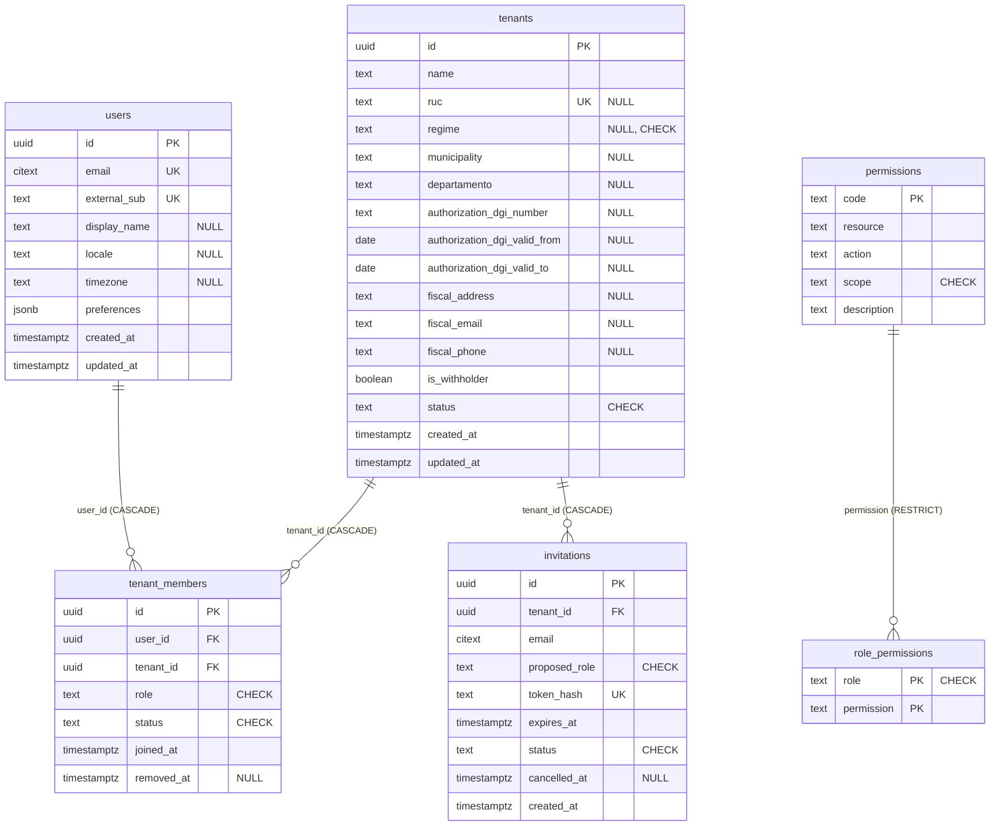

# Esquema físico de la base de datos

Estado del esquema a la migración **`0008_invitations_lookup_indexes`**.
La fuente de verdad es `alembic/versions/` — al añadir una migración,
actualizar este documento. El modelo lógico (agregados, invariantes) vive en
[`docs/04-domain-model.md`](../../docs/04-domain-model.md); las políticas de
multi-tenancy en [`docs/05-multi-tenancy.md`](../../docs/05-multi-tenancy.md).

Motor: PostgreSQL 17. Extensiones: `pgcrypto` (gen_random_uuid), `citext`
(emails case-insensitive).

## Diagrama de relaciones

Tablas sin FK (deliberado — ver notas por tabla):
`auth_local_users`, `auth_local_refresh_tokens`, `outbox`,
`processed_events`, `idempotency_keys`, `system_info`.

## Tablas

### `tenants`

| Columna | Tipo | Null | Default |
|---|---|---|---|
| `id` | uuid | no | `gen_random_uuid()` |
| `name` | text | no | |
| `ruc` | text | sí | |
| `regime` | text | sí | |
| `municipality` | text | sí | |
| `departamento` | text | sí | |
| `authorization_dgi_number` | text | sí | |
| `authorization_dgi_valid_from` | date | sí | |
| `authorization_dgi_valid_to` | date | sí | |
| `fiscal_address` | text | sí | |
| `fiscal_email` | text | sí | |
| `fiscal_phone` | text | sí | |
| `is_withholder` | boolean | no | `false` |
| `status` | text | no | `'active'` |
| `created_at` / `updated_at` | timestamptz | no | `now()` |

- PK `tenants_pkey(id)`; UNIQUE `uq_tenants_ruc(ruc)`.
- CHECK `ck_tenants_regime`: `general | cuota_fija | pequeno_contribuyente | NULL`.
- CHECK `ck_tenants_status`: `provisioning | active | suspended | purged`.
- **Sin RLS**: la visibilidad de tenants se deriva de `tenant_members` (el
  picker lista solo membresías propias); las columnas fiscales son metadatos
  del propio tenant activo.

### `users`

| Columna | Tipo | Null | Default |
|---|---|---|---|
| `id` | uuid | no | `gen_random_uuid()` |
| `email` | citext | no | |
| `external_sub` | text | no | |
| `display_name` / `locale` / `timezone` | text | sí | |
| `preferences` | jsonb | no | `'{}'` |
| `created_at` / `updated_at` | timestamptz | no | `now()` |

- PK `users_pkey(id)`; UNIQUE `users_email_key(email)`, `uq_users_external_sub(external_sub)`.
- `external_sub` enlaza con el IdP (claim `sub` de Cognito o del IdP local).
- **Sin RLS**: tabla global de identidades; el acceso por tenant se media en
  `tenant_members`.

### `tenant_members`

| Columna | Tipo | Null | Default |
|---|---|---|---|
| `id` | uuid | no | `gen_random_uuid()` |
| `user_id` | uuid | no | |
| `tenant_id` | uuid | no | |
| `role` | text | no | |
| `status` | text | no | `'active'` |
| `joined_at` | timestamptz | no | `now()` |
| `removed_at` | timestamptz | sí | |

- PK `tenant_members_pkey(id)`.
- FK `user_id → users(id) ON DELETE CASCADE`; `tenant_id → tenants(id) ON DELETE CASCADE`.
- UNIQUE `uq_tenant_members_user_tenant(user_id, tenant_id)`.
- UNIQUE parcial `uq_tenant_members_owner(tenant_id) WHERE role='owner' AND status='active'`
  — exactamente un owner activo por tenant.
- Índice `ix_tenant_members_tenant_id_joined_at(tenant_id, joined_at)` —
  lista de miembros ordenada.
- CHECK `ck_tenant_members_role`: `owner | admin | accountant | salesperson | viewer`.
- CHECK `ck_tenant_members_status`: `active | removed`.
- **RLS** (ENABLE + FORCE): policy `tenant_members_self` — ver sección RLS.

### `invitations`

| Columna | Tipo | Null | Default |
|---|---|---|---|
| `id` | uuid | no | `gen_random_uuid()` |
| `tenant_id` | uuid | no | |
| `email` | citext | no | |
| `proposed_role` | text | no | |
| `token_hash` | text | no | |
| `expires_at` | timestamptz | no | |
| `status` | text | no | `'pending'` |
| `cancelled_at` | timestamptz | sí | |
| `created_at` | timestamptz | no | `now()` |

- PK `invitations_pkey(id)`; UNIQUE `invitations_token_hash_key(token_hash)`
  (solo se persiste el hash del token, nunca el token).
- FK `tenant_id → tenants(id) ON DELETE CASCADE`.
- Índice `ix_invitations_tenant_id_created_at(tenant_id, created_at)` —
  lista por tenant en orden cronológico inverso (backward scan).
- Índice parcial `ix_invitations_pending_tenant_lower_email(tenant_id, lower(email))
  WHERE status='pending'` — detección de invitación pendiente duplicada.
- CHECK `ck_invitations_role`: `admin | accountant | salesperson | viewer`
  (owner nunca se invita). CHECK `ck_invitations_status`:
  `pending | accepted | cancelled | expired`.
- **RLS** (ENABLE + FORCE): policy `tenant_isolation` — ver sección RLS.

### `permissions` y `role_permissions` (catálogo RBAC)

- `permissions`: PK `code`; columnas `resource`, `action`,
  `scope` (CHECK `own | all | na`), `description`. Sembrada por la migración
  0003 desde `shared_kernel.permissions.catalog`.
- `role_permissions`: PK compuesta `(role, permission)`;
  FK `permission → permissions(code) ON DELETE RESTRICT`;
  CHECK `ck_role_permissions_role`: `viewer | salesperson | accountant | admin | owner`.
- **Sin RLS**: catálogo global de solo lectura para la aplicación.

### `auth_local_users` (solo `APP_ENV=local`)

Ledger de contraseñas del IdP local de desarrollo. **No existe en AWS** —
allí Cognito es el dueño de este estado. La migración 0002 la crea
condicionalmente según `APP_ENV`.

| Columna | Tipo | Null | Default |
|---|---|---|---|
| `id` | uuid | no | `gen_random_uuid()` |
| `email` | citext | no | |
| `password_hash` | text | no | |
| `email_verified` | boolean | no | `false` |
| `verification_code_hash` | text | sí | |
| `verification_code_expires_at` | timestamptz | sí | |
| `verification_attempts` | integer | no | `0` |
| `verification_attempts_reset_at` | timestamptz | sí | |
| `attributes` | jsonb | no | `'{}'` |
| `last_resend_at` | timestamptz | sí | |
| `created_at` / `updated_at` | timestamptz | no | `now()` |

- PK `auth_local_users_pkey(id)`; UNIQUE `auth_local_users_email_key(email)`.
- Sin FK hacia `users` — el esquema local-auth evita constraints cruzados con
  el dominio para poder no existir en AWS.

### `auth_local_refresh_tokens` (ledger de revocación)

| Columna | Tipo | Null |
|---|---|---|
| `jti` | uuid | no (PK) |
| `user_id` | uuid | no |
| `issued_at` | timestamptz | no |
| `revoked_at` | timestamptz | sí |
| `user_agent` | text | sí |
| `ip` | text | sí |

- Índice `ix_auth_local_refresh_tokens_user_revoked(user_id, revoked_at)` —
  hot path de `/v1/auth/refresh` y futuras revocaciones masivas.
- Sin FK (misma razón que `auth_local_users`).

### `outbox`

| Columna | Tipo | Null | Default |
|---|---|---|---|
| `event_id` | uuid | no (PK) | |
| `tenant_id` | uuid | no | |
| `event_type` | text | no | |
| `event_version` | integer | no | `1` |
| `aggregate_type` | text | no | |
| `aggregate_id` | uuid | no | |
| `payload` | jsonb | no | |
| `occurred_at` | timestamptz | no | `now()` |
| `correlation_id` | uuid | sí | |
| `published_at` | timestamptz | sí | |
| `publish_attempts` | integer | no | `0` |

- Índice parcial `idx_outbox_unpublished(occurred_at) WHERE published_at IS NULL`
  — cola del publisher.
- **Sin RLS**: el publisher procesa eventos de todos los tenants.

### `processed_events`, `idempotency_keys`, `system_info`

- `processed_events`: PK `(consumer, event_id)`, `processed_at` default
  `now()` — deduplicación de consumidores de eventos.
- `idempotency_keys`: PK `(tenant_id, key, endpoint)`; `request_hash` NOT
  NULL; `response_status` / `response_body (jsonb)` NULL hasta completar;
  `created_at` default `now()` — replay seguro de mutaciones.
- `system_info`: PK `id` con CHECK `system_info_singleton (id = 1)` —
  fila única de metadatos de despliegue (`migrated_at`, `seed_version`).

## Row-Level Security

Las sesiones de la aplicación fijan dos GUCs transaction-local al abrir la
unidad de trabajo (`set_config(..., true)`):

- `app.tenant_id` — tenant activo del request (UUID cero si el JWT aún no
  tiene tenant activo, p. ej. el picker post-login).
- `app.current_user_id` — usuario autenticado.

Policies (ambas tablas con `ENABLE` + `FORCE ROW LEVEL SECURITY`; en
producción la app conecta con un rol `NOBYPASSRLS`):

| Tabla | Policy | USING | WITH CHECK |
|---|---|---|---|
| `tenant_members` | `tenant_members_self` | `user_id = app.current_user_id OR tenant_id = app.tenant_id` | `tenant_id = app.tenant_id` |
| `invitations` | `tenant_isolation` | `tenant_id = app.tenant_id` | `tenant_id = app.tenant_id` |

La rama `user_id` de `tenant_members_self` permite a un usuario listar sus
propias membresías sin tenant activo (login → picker); las escrituras siempre
exigen el GUC del tenant.

Tablas **sin** RLS y por qué: `tenants` y `users` (la pertenencia se media en
`tenant_members`), `outbox` (publisher cross-tenant), `processed_events` /
`idempotency_keys` / `system_info` (infraestructura), `permissions` /
`role_permissions` (catálogo global), `auth_local_users` /
`auth_local_refresh_tokens` (estado del IdP local, sin concepto de tenant).
