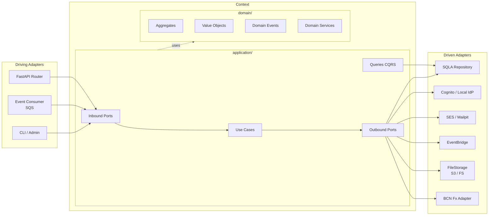

# 02 — Architecture

Hexagonal + DDD + bounded contexts. Rule `domain ← application ← adapters`, validated by `import-linter` (pre-commit, [ADR-0023](adr/0023-no-ci-cd-mvp.md)).

- `domain/` — aggregates, VOs, events, services. No technical imports (stdlib only). VOs as `dataclass(frozen=True)`, not Pydantic.
- `application/` — defines ports (`Protocol`/ABC), orchestrates use cases, no I/O.
- `adapters/` — implement ports (SQLA, Cognito, SES, EventBridge…). Import `domain` + `application`, not the other way around.
- `bootstrap/` — single place that wires adapters to ports.

---

## Diagram — one hexagonal context



---

## Anatomy of a context

Example `contexts/sales/`:

```
sales/
├── domain/
│   ├── model/
│   │   ├── invoice/           # invoice.py, invoice_item.py, invoice_status.py,
│   │   │                      # tax_breakdown.py (VO), events.py
│   │   ├── credit_note/
│   │   ├── quotation/
│   │   └── number_sequence/   # DGI sequential ranges
│   ├── services/              # invoice_pricing_service.py
│   └── errors.py
├── application/
│   ├── ports/
│   │   ├── inbound/           # create_draft_invoice, issue_invoice, cancel_invoice, …
│   │   └── outbound/          # invoice_repository, customer_lookup, product_lookup,
│   │                          # inventory_writer, tax_calculator,
│   │                          # invoice_pdf_renderer, event_publisher
│   ├── use_cases/
│   └── queries/               # CQRS — reads without aggregates
└── adapters/
    ├── inbound/http/          # FastAPI routers
    └── outbound/
        ├── persistence/sqlalchemy/
        ├── pdf/               # weasyprint
        └── eventbridge/
```

### Operating rules

- One aggregate per folder, with its VOs and events alongside.
- **Inbound** ports = what the context offers. **Outbound** = what it needs.
- **Communication between contexts** via outbound port or event. **No cross-imports of models.**
- Synchronous read-only A → B: A defines `customer_lookup` and receives its own DTO (`CustomerForSale`). The adapter invokes a query published by B (`parties.queries.GetCustomerForSale`), it does not read foreign tables.
- Reactive communication: integration event via EventBridge ([07](07-events-and-outbox.md)).

---

## Port → adapter map

The only thing that changes between dev and prod is the wiring in `bootstrap/container.py`.

| Port | Local | AWS |
|---|---|---|
| `UnitOfWork` / repos | SQLA → Postgres container | SQLA → RDS |
| `IdentityProvider` | `IdentityProviderLocal` (JWT + bcrypt) | `IdentityProviderCognito` |
| `EventPublisher` | EventBridge on LocalStack | Real EventBridge |
| `TaskQueue` | SQS on LocalStack | Real SQS |
| `FileStorage` | filesystem (`FileStorageLocal`) or LocalStack | S3 (`FileStorageS3`) |
| `EmailSender` | SMTP → Mailpit | SES sandbox |
| `SecretsProvider` | `.env.local` | SSM Parameter Store ([ADR-0021](adr/0021-ssm-parameter-store.md)) |
| `FxRateProvider` | fixed-rate mock | BCN scraper Lambda |
| `InvoicePdfRenderer` | local weasyprint | weasyprint on Fargate |
| `NumberSequence`, `OutboxWriter`, `Clock`, `IdGenerator` | Postgres / Python stdlib | Identical |

Local adapters in [15](15-local-development.md); AWS in [10](10-infrastructure.md).

---

## Flow: invoice issuance with outbox

```mermaid
sequenceDiagram
    autonumber
    participant C as Client
    participant LB as ALB
    participant API as Fargate
    participant DB as RDS
    participant OB as Outbox Publisher Lambda
    participant EB as EventBridge
    participant Q as SQS
    participant W as Notif Worker Lambda
    participant SES as SES

    C->>LB: POST /v1/invoices/{id}/issue
    LB->>API: forward
    API->>DB: BEGIN
    API->>DB: SET LOCAL app.tenant_id
    API->>DB: lock number_sequence FOR UPDATE; assign sequence
    API->>DB: INSERT invoice + items + tax_lines
    API->>DB: UPDATE inventory; INSERT inventory_movements (kardex)
    API->>DB: INSERT outbox(InvoiceIssued)
    API->>DB: COMMIT
    API->>C: 200 OK

    Note over DB,OB: Scheduler 60 s ([ADR-0007](adr/0007-outbox-dispatch-polling.md))
    OB->>DB: SELECT FROM outbox WHERE published_at IS NULL
    OB->>EB: PutEvents
    OB->>DB: UPDATE published_at

    EB->>Q: rule match
    Q->>W: poll
    W->>DB: idempotency check via processed_events
    W->>SES: SendEmail
    W->>DB: INSERT processed_events
```

Outbox detail in [07](07-events-and-outbox.md).

---

## Monorepo structure

```
nica-erp/
├── apps/
│   ├── api/                       # Python backend
│   │   ├── src/pyme_erp/
│   │   │   ├── shared_kernel/     # AggregateRoot, UoW, Money, OutboxWriter, etc.
│   │   │   ├── contexts/          # identity, tenants, catalog, inventory, parties,
│   │   │   │                      # sales, taxes, payments, reports, notifications, audit
│   │   │   └── bootstrap/         # settings, container, api, entrypoints/{outbox_publisher,
│   │   │                          # audit_consumer, notifications_worker, fx_scraper, migrations}
│   │   ├── tests/{unit,integration,e2e}/
│   │   ├── pyproject.toml
│   │   └── Dockerfile             # multi-purpose image (API + workers)
│   └── web/                       # React + TanStack frontend ([09](09-frontend.md))
├── infra/terraform/
│   ├── bootstrap/                 # state, ECR, S3 web, CloudFront (once)
│   ├── modules/                   # network, data, compute, workers, messaging, auth,
│   │                              # storage, secrets, email, observability
│   └── envs/demo/
├── docker/
├── scripts/
├── Makefile
└── docs/
```

Why Fargate and not Lambda for the API: [ADR-0004](adr/0004-ecs-not-lambda.md). Full Makefile in [11](11-deployment.md).
