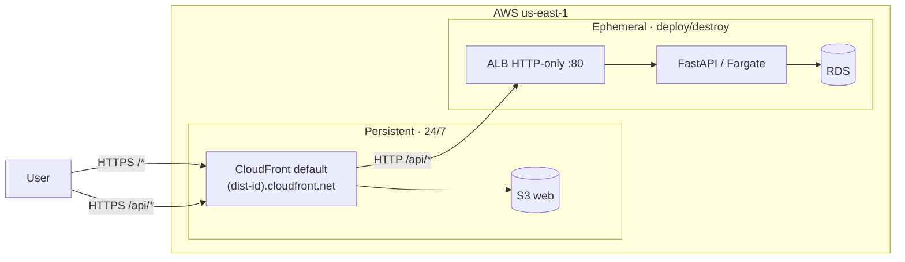
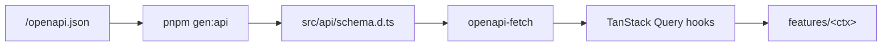

# 09 — Frontend

SPA in `apps/web/` consuming the HTTP API. Built and deployed independently of the backend. Stack decision and rationale in [ADR-0009](adr/0009-frontend-stack.md).

---

## Position



Same AWS account as the backend, in the persistent module. CloudFront default `*.cloudfront.net` is the only HTTPS front-door ([ADR-0020](adr/0020-no-custom-domain-mvp.md)): `/*` → S3 web (SPA), `/api/*` → ALB origin HTTP-only. **Same origin, no CORS.** With the backend destroyed, the HTML loads; `/api/*` returns 502.

S3 + CloudFront are provisioned in [sprint 01](sprints/01-aws-wiring-rolling-deploys.md). Each subsequent slice uploads a build with `make deploy-web` (seconds).

---

## Stack

The full stack table (TypeScript 5 strict, React 18, TanStack Router/Query/Table/Form, Vite, Tailwind, shadcn/ui, Zod, pnpm, Vitest, etc.) is the body of [ADR-0009](adr/0009-frontend-stack.md); it is not duplicated here. TypeScript flags (`noUncheckedIndexedAccess`, `noImplicitOverride`, `exactOptionalPropertyTypes`; `any` banned by ESLint) and per-tool conventions are detailed in [16 — Tooling §TypeScript](16-tooling.md#typescript-appsweb).

---

## Structure

```
apps/web/
├── public/
├── src/
│   ├── main.tsx
│   ├── app.tsx
│   ├── routes/                       # TanStack Router file-based
│   ├── components/ui/                # shadcn/ui copied
│   ├── features/                     # one per backend bounded context
│   │   ├── auth/  catalog/  inventory/  parties/  sales/  taxes/  reports/
│   ├── api/                          # OpenAPI client + TanStack Query wrappers
│   ├── lib/                          # formatters, validators
│   ├── i18n/
│   └── styles/
├── vite.config.ts  tailwind.config.ts  tsconfig.json  eslint.config.js
└── package.json  pnpm-lock.yaml
```

Each `features/<x>/` maps to a backend bounded context ([03](03-bounded-contexts.md)).

---

## Architecture

Four rules constrain how features compose. Everything else (state shape, component decomposition, hook granularity) is decided per slice. The backend has hexagonal + import-linter ([02](02-architecture.md)); the frontend is lighter because the typed API client already pins most contracts — these rules cover what the type system can't.

### 1. No cross-feature imports

`features/<a>/` may **not** import from `features/<b>/`. Shared code lives in:

- `src/api/` — generated client + TanStack Query hooks (cross-context allowed).
- `src/lib/` — pure utilities (formatters, validators, currency, date).
- `src/components/ui/` — shadcn primitives.

If two features need to share a non-trivial component, it graduates to `src/components/<name>/`. If they need to share domain logic, the logic was misplaced — it belongs in the backend or in `src/lib/`.

Enforced by ESLint `no-restricted-imports` with a pattern blocking `features/*/` from any path that contains another `features/`. Failure breaks `pnpm lint`.

### 2. Permission gating

Backend is the source of truth ([ADR-0022](adr/0022-rbac-model.md)). The SPA reads `permissions: string[]` from `GET /v1/me` ([06 §RBAC summary](06-security-model.md#authorization-rbac)) and uses two primitives to hide UI:

```tsx
// hook
const canCancel = usePermission("invoice:cancel");

// component (route / button / menu item)
<Can permission="invoice:cancel">
  <Button onClick={cancelInvoice}>Anular</Button>
</Can>

// route guard (TanStack Router beforeLoad)
beforeLoad: ({ context }) => requirePermission(context, "invoice:read")
```

Rules:

- **Never gate business logic on the client** — hiding a button is UX; the endpoint's `require(...)` is the defense.
- Permission codes are **string literals matching the backend catalog**. A typed union (`PermissionCode`) is generated alongside the OpenAPI client and used by `usePermission` / `<Can>`; an unknown code fails `tsc`.
- Ownership variants (`invoice:read` vs `invoice:read-all`) are not a UI concern — the list endpoint already returns only what the actor can see ([06 §Ownership](06-security-model.md#authorization-rbac)).

### 3. Error handling

All 4xx/5xx responses are RFC 7807 ([ADR-0015](adr/0015-rfc7807-errors.md), [08 §Errors](08-api-conventions.md#errors--rfc-7807-problem-details)). A single mapper in `src/api/errors.ts` turns a `ProblemDetails` into one of four outcomes:

| Outcome | When | Action |
|---|---|---|
| **Form error** | `422` with `errors[]` extension | Attach to TanStack Form field by `pointer` |
| **Toast** | `400`, `409`, `5xx` | `sonner.error(detail)` |
| **Redirect** | `401` | Clear token, `navigate('/login')` |
| **Silent log** | `403` with `type=missing-permission` | Log only — `<Can>` should have prevented the call; surfacing means a stale `/me` |

TanStack Query's `onError` calls `mapProblemDetails(err)`. No `try/catch` inside components. One error boundary per route (`src/routes/__root.tsx`) catches render-time crashes.

### 4. Forms

One Zod schema per form, in `features/<x>/schemas/<form>.ts`. The schema is the single source of truth:

```ts
export const invoiceDraftSchema = z.object({ ... });
export type InvoiceDraft = z.infer<typeof invoiceDraftSchema>;
```

- Same schema feeds TanStack Form validators and any optimistic local computation.
- **Not derived from the OpenAPI schema** — server schemas describe wire format; form schemas describe user input (different fields, different optionality, often different types). Overlap is intentional, not enforced.
- Backend `422` errors are attached by JSON pointer (rule 3), not duplicated as client validation.

---

## Typed HTTP client

`openapi-typescript` generates types from `/openapi.json`; `openapi-fetch` provides a typed runtime.



```bash
pnpm gen:api   # openapi-typescript http://localhost:8000/openapi.json -o src/api/schema.d.ts
```

Flow: backend running → `pnpm gen:api` → diff of `src/api/schema.d.ts` committed with the frontend change. **CI** brings up an ephemeral backend (compose + migrate), runs `pnpm gen:api`, and fails if `git diff src/api/schema.d.ts` is non-empty. `tsc --noEmit` closes the loop: a changed schema breaks compilation in the hooks that consume it.

Per-endpoint TanStack Query hooks (`useInvoiceQuery(id)`, etc.) sit on top of the client. An API change breaks the frontend at compile time, not at runtime.

---

## Authentication

JWT obtained from `POST /v1/auth/login` is attached as `Authorization: Bearer <token>` by the HTTP client middleware.

Token storage, refresh, and XSS considerations live in [`06-security-model.md`](06-security-model.md) §Frontend tokens.

**Active tenant**: claim `custom:active_tenant`. Empty at login → `/onboarding/tenant`. Switching: `POST /v1/tenants/{id}/switch` returns a fresh JWT and the app **reloads** (not in-place).

Identity port detail in [`06-security-model.md`](06-security-model.md).

---

## Local development

Requirements: Node 20 LTS, pnpm 9.

```bash
cd apps/web
pnpm install
pnpm dev          # Vite http://localhost:5173
pnpm build / preview / lint / test / typecheck
```

`.env.local` (not versioned): `VITE_API_BASE_URL=http://localhost:8000`, `VITE_APP_ENV=local`.

---

## Deployment

Static site in the persistent module (`infra/terraform/bootstrap/`): backend `make destroy` **does not** affect it. `make wipe` does.

Resources ([ADR-0020](adr/0020-no-custom-domain-mvp.md)):

- **S3 `nica-erp-web`** private with `dist/`. No website hosting; access only via CloudFront.
- **CloudFront** with OAC and default `*.cloudfront.net` cert. Custom error responses `403`/`404` → `/index.html 200` (TanStack Router SPA). Behaviors: `/*` → S3, `/api/*` → ALB origin (HTTP-only, no cache).
- **No Route 53, no custom ACM**. Custom domain activation in [11 §Activate custom domain](11-deployment.md#activate-custom-domain).

`make deploy-web`: `pnpm build` + `aws s3 sync dist/ s3://nica-erp-web/ --delete` with `cache-control "public,max-age=31536000,immutable"` for hashed assets, `index.html` separated with `no-cache,no-store,must-revalidate` + `aws cloudfront create-invalidation --paths '/index.html'` (hashed assets change name, no invalidation needed). Seconds. Implementation in [11 — Deployment §Makefile](11-deployment.md#makefile).

### Per-build variables

Vite embeds `VITE_*` at build time. **No `VITE_*` may carry secrets** (the bundle is public).

| Build | `VITE_API_BASE_URL` | Source |
|---|---|---|
| Local dev | `http://localhost:8000` | `.env.local` |
| Local preview | same as dev | `.env.local` |
| Production ([sprint 01](sprints/01-aws-wiring-rolling-deploys.md)+) | `/api` (relative) | `.env.production` versioned **without** secrets. SPA and API share origin ([ADR-0020](adr/0020-no-custom-domain-mvp.md)). |

### Idle cost

S3 ~5 MB ≈ $0.0001/month; CloudFront with no traffic = $0; no Route 53 or ACM. Frontend reachable 24/7 without contributing to the idle bill.

### Why the persistent module

Provisioning/destroying CloudFront takes 5–15 min; bundling it into the ephemeral module would add that time to every cycle without benefit. Persistent: backend `make deploy/destroy` ~12 min; `make deploy-web` with `s3 sync` + invalidation only when the frontend code changes.

---

## Static checks (GitHub Actions)

`.github/workflows/web-checks.yml` on every PR/push: `pnpm install --frozen-lockfile`, `pnpm typecheck`, `pnpm lint`, `pnpm format:check` (`prettier --check .`), `pnpm test --run`. E2E is manual in MVP. No automated deploy ([ADR-0023](adr/0023-no-ci-cd-mvp.md)). Full detail in [16 — Tooling §GitHub Actions](16-tooling.md#github-actions).

---

## Out of scope

SSR (evaluate TanStack Start), native mobile app, offline mode, web push, in-place tenant switch (requires JWT reissue + reload).
