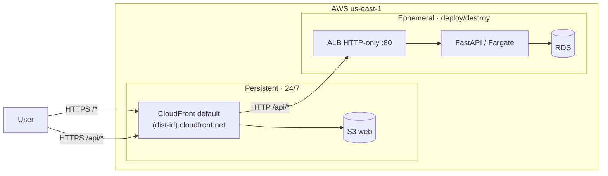
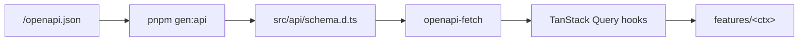

# 09 — Frontend

SPA in `apps/web/` consuming the HTTP API. Built and deployed independently of the backend. Stack decision and rationale in [ADR-0009](adr/0009-frontend-stack.md).

---

## Position



Same AWS account as the backend, in the persistent module. CloudFront default `*.cloudfront.net` is the only HTTPS front-door ([ADR-0020](adr/0020-no-custom-domain-mvp.md)): `/*` → S3 web (SPA), `/api/*` → ALB origin HTTP-only. **Same origin, no CORS.** With the backend destroyed, the HTML loads; `/api/*` returns 502.

S3 + CloudFront are provisioned in [sprint 01](sprints/01-aws-wiring-rolling-deploys.md). Each subsequent slice uploads a build with `make deploy-web` (seconds).

---

## Stack

The full stack table (TypeScript 5 strict, React 18, TanStack Router/Query/Table/Form, Vite, Tailwind, shadcn/ui, Zod, pnpm, Vitest, etc.) is the body of [ADR-0009](adr/0009-frontend-stack.md); it is not duplicated here. TypeScript flags (`noUncheckedIndexedAccess`, `noImplicitOverride`, `exactOptionalPropertyTypes`; `any` banned by ESLint) and per-tool conventions are detailed in [16 — Tooling §TypeScript](16-tooling.md#typescript-appsweb).

---

## Structure

```
apps/web/
├── public/
├── src/
│   ├── main.tsx
│   ├── app.tsx
│   ├── routes/                       # TanStack Router file-based
│   ├── components/ui/                # shadcn/ui copied
│   ├── components/app-shell/         # AppShell + SiteHeader (auth layout)
│   ├── components/app-sidebar/       # Sidebar primitives + AppSidebar
│   ├── features/                     # one per backend bounded context
│   │   ├── auth/  catalog/  inventory/  parties/  sales/  taxes/  reports/
│   ├── api/                          # OpenAPI client + TanStack Query wrappers
│   ├── lib/                          # formatters, validators
│   ├── i18n/
│   └── styles/
├── vite.config.ts  tailwind.config.ts  tsconfig.json  eslint.config.js
└── package.json  pnpm-lock.yaml
```

Each `features/<x>/` maps to a backend bounded context ([03](03-bounded-contexts.md)).

---

## Styling

Tailwind v4 with CSS-first configuration. Three conventions to know:

- **Single import.** `src/styles/globals.css` starts with `@import "tailwindcss"` — no `@tailwind base/components/utilities` directive trio. Animations come from `@import "tw-animate-css"` (replaces the deprecated `tailwindcss-animate` plugin).
- **Tokens live in `@theme inline {}`.** Colour and `borderRadius` design tokens are declared in a `@theme inline {}` block inside `globals.css`, each mapped to a `:root` / `.dark` CSS variable. `tailwind.config.ts` is kept down to `darkMode + content` and is referenced from CSS via `@config "../../tailwind.config.ts"`.
- **OKLCH for colours.** All palette tokens use `oklch(L C h)`. The `:root` block defines the light palette, `.dark` overrides for dark mode. Add new tokens by appending to both blocks plus the `@theme inline` map.

Vendor prefixing and hashed font URLs are handled by `@tailwindcss/vite` (the only CSS pipeline plugin; there is no `postcss.config.js`). The `radix-mira` shadcn registry style is pinned in `components.json` with `baseColor: "olive"`.

---

## Architecture

Four rules constrain how features compose. Everything else (state shape, component decomposition, hook granularity) is decided per slice. The backend has hexagonal + import-linter ([02](02-architecture.md)); the frontend is lighter because the typed API client already pins most contracts — these rules cover what the type system can't.

### 1. No cross-feature imports

`features/<a>/` may **not** import from `features/<b>/`. Shared code lives in:

- `src/api/` — generated client + TanStack Query hooks (cross-context allowed).
- `src/lib/` — pure utilities (formatters, validators, currency, date).
- `src/components/ui/` — shadcn primitives.

If two features need to share a non-trivial component, it graduates to `src/components/<name>/`. If they need to share domain logic, the logic was misplaced — it belongs in the backend or in `src/lib/`.

Enforced by ESLint `no-restricted-imports` with a pattern blocking `features/*/` from any path that contains another `features/`. Failure breaks `pnpm lint`.

### 2. Permission gating

Backend is the source of truth ([ADR-0022](adr/0022-rbac-model.md)). The SPA reads `permissions: string[]` from `GET /v1/me` ([06 §RBAC summary](06-security-model.md#authorization-rbac)) and uses two primitives to hide UI:

```tsx
// hook
const canCancel = usePermission("invoice:cancel");

// component (route / button / menu item)
<Can permission="invoice:cancel">
  <Button onClick={cancelInvoice}>Anular</Button>
</Can>

// route guard (TanStack Router beforeLoad)
beforeLoad: ({ context }) => requirePermission(context, "invoice:read")
```

Rules:

- **Never gate business logic on the client** — hiding a button is UX; the endpoint's `require(...)` is the defense.
- Permission codes are **string literals matching the backend catalog**. A typed union (`PermissionCode`) is generated alongside the OpenAPI client and used by `usePermission` / `<Can>`; an unknown code fails `tsc`.
- Ownership variants (`invoice:read` vs `invoice:read-all`) are not a UI concern — the list endpoint already returns only what the actor can see ([06 §Ownership](06-security-model.md#authorization-rbac)).

### 3. Error handling

All 4xx/5xx responses are RFC 7807 ([ADR-0015](adr/0015-rfc7807-errors.md), [08 §Errors](08-api-conventions.md#errors--rfc-7807-problem-details)). A single mapper in `src/api/errors.ts` turns a `ProblemDetails` into one of four outcomes:

| Outcome | When | Action |
|---|---|---|
| **Form error** | `422` with `errors[]` extension | Attach to TanStack Form field by `pointer` |
| **Toast** | `400`, `409`, `5xx` | `sonner.error(detail)` |
| **Redirect** | `401` | Clear token, `navigate('/login')` |
| **Silent log** | `403` with `type=missing-permission` | Log only — `<Can>` should have prevented the call; surfacing means a stale `/me` |

TanStack Query's `onError` calls `mapProblemDetails(err)`. No `try/catch` inside components.

#### Route error fallbacks

Render-time and loader failures are caught by TanStack Router boundaries and routed by `dispatchRouteError(error)` to one of four cards:

| Category | Trigger | Card |
|---|---|---|
| **Forbidden** | `ApiError.status === 403` | `RouteForbiddenCard` |
| **Not found** | `ApiError.status === 404`, or unmatched URL via `notFoundComponent` | `RouteNotFoundCard` |
| **Schema mismatch** | `instanceof ZodError` | `RouteSchemaErrorCard` |
| **Runtime** | anything else | `RouteRuntimeErrorCard` |

There are two boundary layers:

- **Root** (`src/routes/__root.tsx`) — `errorComponent` and `notFoundComponent` render the fallback inside the bare `BrandLayout` (no sidebar) so the chrome stays consistent with the `/login` shell when a failure escapes the shell.
- **In-shell** — every AppShell-bearing route (`/dashboard`, `/sales`, `/inventory`, `/reports`, `/settings`, `/empresa`, `/empresa/users`, `/empresa/settings`) declares `errorComponent: InShellErrorBoundary` so a child loader failure renders the fallback inside the sidebar context. The operator keeps their nav anchor instead of getting bounced to a chromeless screen.

The recovery button is auth-aware: `getAccessToken()` is read synchronously (never `useMeQuery`, which may itself be the source of the boundary) and links to `/dashboard` when present, `/login` otherwise. The link is a plain `<a>` — a hard navigation forces a fresh app boot, which is the correct recovery action from a broken state.

#### Destructive-confirm pattern

Every destructive action in the empresa surface (remove member, cancel invitation, delete tenant data) is gated by `<DestructiveActionDialog>` (`src/components/dialog/destructive-action-dialog.tsx`). The wrapper is a thin facade over shadcn's `<AlertDialog>` that codifies four contracts:

- **Cancel is the focused default.** The cancel button is rendered first and carries `autoFocus`, so an accidental `Enter` after the dialog opens does NOT fire the destructive action. Operators reach the confirm button only after a deliberate `Tab`.
- **Confirm uses the destructive variant.** The confirm button picks up `buttonVariants({ variant: "destructive" })` so the styling matches across all call sites.
- **Escape and overlay click close without firing `onConfirm`.** Inherited from the Radix primitive; the wrapper never overrides it.
- **Pending state disables both buttons.** Pass `pending` from the mutation's `isPending` to prevent double-clicks and Enter-spam while the destructive request is in flight.

Use it whenever the operator's next click is irreversible. The wrapper's trigger lives at the call site (a row button, a dropdown menu item) — the wrapper itself only renders the dialog.

#### Mobile-card pattern for data tables

Data tables that hosts surfaces are routinely opened on phones (members, invitations, future invoice lists) render two layouts side-by-side:

```tsx
<div className="hidden md:block">  {/* desktop <table> */} </div>
<div className="md:hidden space-y-2"> {/* one <Card> per row */} </div>
```

The desktop branch is the canonical TanStack Table render. The mobile branch reuses the same `table.getRowModel().rows` so sorting, filtering, and pagination apply once and the two layouts stay in lock-step. The mobile card orders fields top-to-bottom: title (nombre / asunto), subtitle (correo), then a row of badges (rol, estado), with the action affordance (if any) at the bottom. Pagination renders outside both branches via `<TablePagination>` so the operator sees one set of page controls regardless of viewport.

The breakpoint is fixed at `md` (768px) — pre-tablet phones get the cards, everything else gets the table. The cards do not collapse to a denser table on intermediate widths because the resulting wrapping looks worse than either pure layout.

#### Closed-sidebar a11y contract

When the app sidebar is closed on a mobile viewport (`< 768px`), the panel applies three guards in tandem (`src/components/app-sidebar/sidebar.tsx::Sidebar`):

- `aria-hidden="true"` — screen readers skip the panel entirely.
- `inert` (HTML boolean attribute) — keyboard `Tab` traversal does not enter the panel, and focus cannot land on any descendant.
- `hidden` (Tailwind `display:none`) — the panel takes up no layout space and is invisible to sighted users.

All three are removed in lock-step when the sidebar opens OR the viewport widens past 768px (watched via `window.matchMedia("(max-width: 767px)")`). The header trigger button carries `aria-controls={SIDEBAR_ROOT_ID}` + `aria-expanded={mobileOpen}` and swaps its Spanish label between `"Abrir menú"` and `"Cerrar menú"` so assistive tech announces the state change after every click.

The trio is intentional: any one of the guards alone is insufficient for one of the user classes. `aria-hidden` alone leaves the panel keyboard-traversable; `inert` alone leaves it announced by screen readers in some configurations; `hidden` alone leaves the markup parseable but tab order skipping is browser-dependent.

#### Empresa-scoped editor forms

Forms that mutate the active empresa's data (e.g. the fiscal-settings editor at `/empresa/settings`) live under `apps/web/src/features/tenants/`:

- **Schema** in `features/tenants/schemas/<form>.ts` (Zod). The schema owns every error message in Spanish; the form's RHF + `zodResolver` pipes Zod issues into RHF field state automatically.
- **Component** in `features/tenants/components/<form>.tsx` (RHF + `<Controller>`). Permission gating happens here via `useHasPermission("tenant.update")` — without the permission the form renders a read-only summary card with a Spanish help-card explaining who can edit.
- **Route** in `routes/empresa/<x>.tsx` stays thin: it reads `useMeQuery().data?.active_tenant`, calls `useTenantQuery(activeId)`, renders a skeleton while the payload loads, and hands the resolved tenant to the form component.
- **Mutation** uses `useUpdateActiveTenantMutation` from `features/tenants/api/hooks.ts`, which reads `useActiveTenantId()` so consumers don't pass the empresa id explicitly. On success the hook does `setQueryData(tenantKey(activeId), updated)` and invalidates `myTenantsKey`; the dashboard banner watching the same key disappears without a reload.

Backend error mapping flows through the form's `onError` handler: a 422 problem-detail body's `errors[]` array is walked by `mapApiProblemToFormErrors(form, problem)` (exported alongside the form component), which calls `form.setError(path, …)` per JSON-pointer. A 409 RUC collision renders as a top-of-form `<Alert>` rather than a field-level error since the value is syntactically fine.

#### Form errors

Inline auth-error display lives in a single component — `apps/web/src/components/form/form-error-alert.tsx`:

```tsx
<FormErrorAlert error={mutation.error} />
```

The four auth routes (`/login`, `/confirm`, `/forgot-password`, `/reset-password`) render this above their submit button whenever the mutation's `error` is non-null. The component is intentionally thin: it reads `messageForProblem(error)` from `src/api/errors.ts` and renders the resulting Spanish string inside an alert block with `role="alert"` + `aria-live="assertive"`.

The registry rule: every problem code the backend can emit on an auth route MUST have an entry in `SPANISH_BY_CODE`. Unknown codes fall through to the generic copy `"Ocurrió un error. Intenta de nuevo."` — the raw English `code` is never surfaced to the operator. `KNOWN_AUTH_PROBLEM_CODES` is the authoritative list; a unit test asserts the spec-mandated codes are present so a regression renaming a code without a registry update fails CI rather than the next operator's screen. The lockout code (`auth.lockout_active`) templates the `Retry-After` window into Spanish minutes via `formatLockoutMinutes`, which rounds up and clamps at 1 minute.

Navigation in auth routes happens from `onSuccess` only — never from `onSettled` or `onError`. On a failed mutation the route stays put, the form fields remain enabled, and the alert renders. On a clean attempt the alert disappears on the next render because the mutation's `error` reverts to `null`.

#### Query-client lifecycle

Two invariants keep cached data coherent across identity transitions:

- **Logout** (`useLogoutMutation.onSettled` in `features/auth/api/hooks.ts`) runs `clear()` (token store), then `clearPickerConfirmed()`, then `qc.clear()` — in that order. The token store is cleared first so any retry queued by React Query before this point sees the empty store and aborts rather than refetching under the prior identity's bearer.
- **Per-tenant queries** (`useTenantQuery`, `useMembersQuery`, `useInvitationsQuery`) gate `enabled` on `tenantId !== "" && tenantId === me.active_tenant`. The active id is read via the shared `useActiveTenantId()` hook (lives in `src/api/` so neither the auth nor tenants slice has to cross-import the other). The strict-equality gate blocks the `SwitchActiveTenant` race window — between the new JWT minting and the `/v1/me` refetch a stale id would otherwise fire a request to the previous empresa.

### 4. Forms

One Zod schema per form, in `features/<x>/schemas/<form>.ts`. The schema is the single source of truth:

```ts
export const invoiceDraftSchema = z.object({ ... });
export type InvoiceDraft = z.infer<typeof invoiceDraftSchema>;
```

- Same schema feeds TanStack Form validators and any optimistic local computation.
- **Not derived from the OpenAPI schema** — server schemas describe wire format; form schemas describe user input (different fields, different optionality, often different types). Overlap is intentional, not enforced.
- Backend `422` errors are attached by JSON pointer (rule 3), not duplicated as client validation.

---

## App shell

Authenticated routes render inside an **app shell** modeled on the shadcn [`dashboard-01`](https://ui.shadcn.com/blocks) block: a fixed left sidebar + a site-header on top of the main column. The shell is introduced in [sprint 03](sprints/03-tenants-and-rls.md#dashboard-shell--account-screen) and reused unchanged by every sprint from 04 onwards.

```
┌─────────────┬──────────────────────────────────────────┐
│             │  SiteHeader  · breadcrumb · theme toggle │
│  Sidebar    ├──────────────────────────────────────────┤
│  · header   │                                          │
│    Tenant‑  │  <Outlet/>  ← route content              │
│    Switcher │                                          │
│  · nav      │                                          │
│    Overview │                                          │
│    Sales    │                                          │
│    …        │                                          │
│  · footer   │                                          │
│    Account  │                                          │
│    Sign out │                                          │
└─────────────┴──────────────────────────────────────────┘
```

Layout:

- **Sidebar** lives in `src/components/app-sidebar/`. Header hosts the `TenantSwitcher`; content hosts the nav groups; footer hosts the `Account` link + `Sign out` button. The sidebar collapses to icon-only on desktop (`< xl`) and slides off-canvas on mobile via a header trigger.
- **SiteHeader** lives in `src/components/app-shell/SiteHeader.tsx`. It carries the sidebar trigger (mobile), the breadcrumb derived from the active route, and a theme toggle. Page actions (e.g. "New tenant" on `/tenants`) are NOT rendered here — they live inside the page so each route owns its own primary actions.
- **AppShell** (`src/components/app-shell/AppShell.tsx`) composes the two and renders `{children}` in the main column. A route opts in by wrapping its return in `<AppShell>{...}</AppShell>`. Auth screens (`/login`, `/signup`, `/confirm`, `/forgot-password`, `/reset-password`) and the public `/invitations/$token/accept` route bypass the shell.

The sidebar tokens (`--sidebar`, `--sidebar-foreground`, `--sidebar-primary`, `--sidebar-accent`, `--sidebar-border`, `--sidebar-ring`) already live in `src/styles/globals.css`, so light/dark inherit automatically from the theme provider. No new npm dependencies — the shell is built on Tailwind utilities + a small handful of internal primitives.

### Placeholder routes

`/dashboard`, `/sales`, `/inventory`, `/reports`, `/settings` ship as placeholders in sprint 03 because the backend bounded contexts arrive in sprints 04-08. Rules:

- A placeholder MUST NOT call the backend (no `useQuery` against a non-existent endpoint).
- A placeholder MUST render a single `<Card>` with the nav label as title and a one-line "Coming soon" description. **No sprint numbers in product UI** — the placeholder advertises that the section is coming, not when.
- No fake numbers in cards, no random-data charts — the placeholder advertises what is missing, not pretends it exists.

`/dashboard` is the only placeholder with a richer skeleton: four KPI-shaped `<Card>` slots + one chart-shaped panel + one table-shaped panel, each labelled "placeholder". The shape exists so sprints 04-08 can drop real components into known anchors without re-laying-out the page.

### `/account`

`/account` is the non-placeholder companion to the dashboard shell — sprint 03 wires real data because the sprint already owns `/v1/me` (extended with `role` and `permissions` per [§RBAC summary](06-security-model.md#authorization-rbac)). The page renders three cards:

1. **Profile** — `id`, `email`, `display_name`, `locale`, `timezone`, `preferences` (read-only display).
2. **Active tenant** — name + RUC of the active tenant + role badge. Pulled from `/v1/tenants/me` filtered by `me.active_tenant`.
3. **Permissions** — bulleted list of `me.permissions`.

`/me` (sprint 02's profile page) is replaced by a redirect to `/account` so existing bookmarks and tests keep working.

### Permission gating on the nav

The sidebar nav items render unconditionally in sprint 03 — there is no observable difference between a hidden item and one with no destination. From sprint 04 onwards, each nav item wraps in `<Can permission="...">` ([§2 Permission gating](#2-permission-gating)) as the real screen for that section lands.

---

## Typed HTTP client

`openapi-typescript` generates types from `/openapi.json`; `openapi-fetch` provides a typed runtime.



```bash
pnpm gen:api   # openapi-typescript http://localhost:8000/openapi.json -o src/api/schema.d.ts
```

Flow: backend running → `pnpm gen:api` → diff of `src/api/schema.d.ts` committed with the frontend change. **CI** brings up an ephemeral backend (compose + migrate), runs `pnpm gen:api`, and fails if `git diff src/api/schema.d.ts` is non-empty. `tsc --noEmit` closes the loop: a changed schema breaks compilation in the hooks that consume it.

Per-endpoint TanStack Query hooks (`useInvoiceQuery(id)`, etc.) sit on top of the client. An API change breaks the frontend at compile time, not at runtime.

---

## Authentication

JWT obtained from `POST /v1/auth/login` is attached as `Authorization: Bearer <token>` by the HTTP client middleware.

Token storage, refresh, and XSS considerations live in [`06-security-model.md`](06-security-model.md) §Frontend tokens.

**Active tenant**: claim `custom:active_tenant`. Empty at login → `/onboarding/tenant`. Switching: `POST /v1/tenants/{id}/switch` returns a fresh JWT and the app **reloads** (not in-place).

Identity port detail in [`06-security-model.md`](06-security-model.md).

---

## Local development

Requirements: Node 20 LTS, pnpm 9.

```bash
cd apps/web
pnpm install
pnpm dev          # Vite http://localhost:5173
pnpm build / preview / lint / test / typecheck
```

`.env.local` (not versioned): `VITE_API_BASE_URL=http://localhost:8000`, `VITE_APP_ENV=local`.

---

## Deployment

Static site in the persistent module (`infra/terraform/bootstrap/`): backend `make destroy` **does not** affect it. `make wipe` does.

Resources ([ADR-0020](adr/0020-no-custom-domain-mvp.md)):

- **S3 `nica-erp-web`** private with `dist/`. No website hosting; access only via CloudFront.
- **CloudFront** with OAC and default `*.cloudfront.net` cert. Custom error responses `403`/`404` → `/index.html 200` (TanStack Router SPA). Behaviors: `/*` → S3, `/api/*` → ALB origin (HTTP-only, no cache).
- **No Route 53, no custom ACM**. Custom domain activation in [11 §Activate custom domain](11-deployment.md#activate-custom-domain).

`make deploy-web`: `pnpm build` + `aws s3 sync dist/ s3://nica-erp-web/ --delete` with `cache-control "public,max-age=31536000,immutable"` for hashed assets, `index.html` separated with `no-cache,no-store,must-revalidate` + `aws cloudfront create-invalidation --paths '/index.html'` (hashed assets change name, no invalidation needed). Seconds. Implementation in [11 — Deployment §Makefile](11-deployment.md#makefile).

### Per-build variables

Vite embeds `VITE_*` at build time. **No `VITE_*` may carry secrets** (the bundle is public).

| Build | `VITE_API_BASE_URL` | Source |
|---|---|---|
| Local dev | `http://localhost:8000` | `.env.local` |
| Local preview | same as dev | `.env.local` |
| Production ([sprint 01](sprints/01-aws-wiring-rolling-deploys.md)+) | `/api` (relative) | `.env.production` versioned **without** secrets. SPA and API share origin ([ADR-0020](adr/0020-no-custom-domain-mvp.md)). |

### Idle cost

S3 ~5 MB ≈ $0.0001/month; CloudFront with no traffic = $0; no Route 53 or ACM. Frontend reachable 24/7 without contributing to the idle bill.

### Why the persistent module

Provisioning/destroying CloudFront takes 5–15 min; bundling it into the ephemeral module would add that time to every cycle without benefit. Persistent: backend `make deploy/destroy` ~12 min; `make deploy-web` with `s3 sync` + invalidation only when the frontend code changes.

---

## Static checks (GitHub Actions)

`.github/workflows/web-checks.yml` on every PR/push: `pnpm install --frozen-lockfile`, `pnpm typecheck`, `pnpm lint`, `pnpm format:check` (`prettier --check .`), `pnpm test --run`. E2E is manual in MVP. No automated deploy ([ADR-0023](adr/0023-no-ci-cd-mvp.md)). Full detail in [16 — Tooling §GitHub Actions](16-tooling.md#github-actions).

---

## Out of scope

SSR (evaluate TanStack Start), native mobile app, offline mode, web push, in-place tenant switch (requires JWT reissue + reload).
