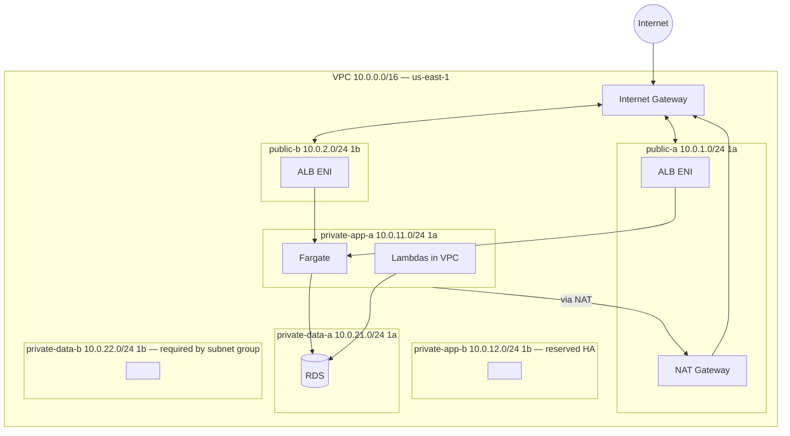
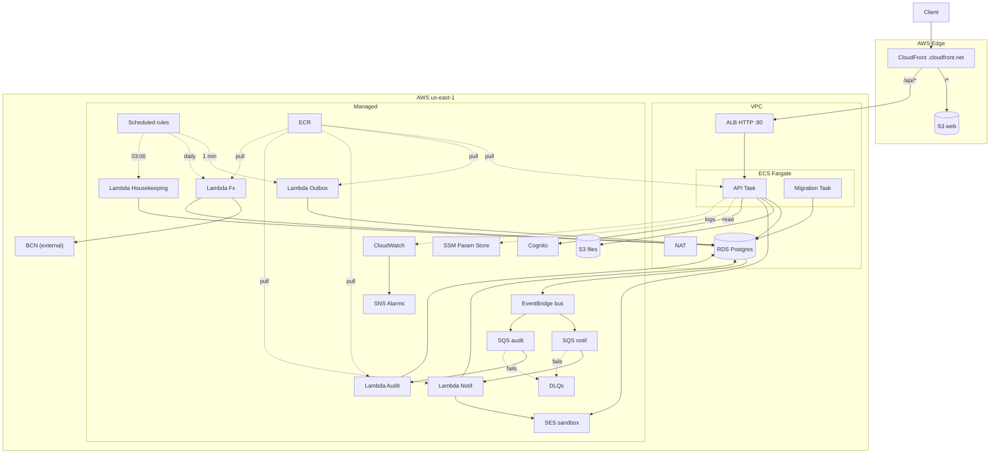

# 10 — AWS Infrastructure

This document describes the AWS resources that compose the runtime — what's deployed, how it's sized, what's excluded. Deploy mechanics in [`11-deployment.md`](11-deployment.md); observability in [`12-observability.md`](12-observability.md); local equivalents in [`15-local-development.md`](15-local-development.md).

One account, `us-east-1`. 100% Terraform. Pre-launch: the stack is brought up for demos / validation / sprint verification and then destroyed; at the first productive tenant it stops being destroyed and the switches in §Capacity kick in.

Frontend in the **same account**, in the persistent bootstrap module (S3 + CloudFront). CloudFront is also the HTTPS front-door for the API via the `/api/*` behavior → ALB ([ADR-0020](adr/0020-no-custom-domain-mvp.md)). Detail in [09 § Deployment](09-frontend.md#deployment).

---

## Stack

| Layer | Service | Configuration |
|---|---|---|
| API | ECS Fargate task `0.25 vCPU / 0.5 GB`, uvicorn | Hot process, 1 task. |
| ALB | in public subnets, target IP | **HTTP only :80**. Inbound restricted to the prefix list `com.amazonaws.global.cloudfront.origin-facing` ([ADR-0020](adr/0020-no-custom-domain-mvp.md)). TLS terminates at CloudFront. |
| HTTPS front-door | CloudFront default `*.cloudfront.net` | `/*` → S3 web; `/api/*` → ALB origin (`http-only`, cache TTL 0, forward `Authorization` + `Cookie`). Default cert free. |
| DB | RDS Postgres 16 `db.t4g.micro` single-AZ gp3 20 GB | Private subnets. **Pre-launch**: `skip_final_snapshot=true`, `backup_retention=0` ([ADR-0017](adr/0017-backups-pitr.md)). |
| Workers | Lambda container image **inside the VPC** | outbox, audit, notif, fx, housekeeping. |
| Storage | S3 `files` (env), `web` (bootstrap), `tf-state` (bootstrap) | Versioning on `files` and `tf-state`. `web` private via OAC. |
| Email | SES email-only permanent sandbox | No domain; up to 50 verified identities ([ADR-0020](adr/0020-no-custom-domain-mvp.md)). Current sandbox quota: **3,000 emails/month and 200/day** (the historical 62k/month free tier from EC2 was removed in Sep 2024). Enough for MVP; at the first productive tenant exit the sandbox with a domain identity + ticket. |
| Queues | SQS standard + DLQs, `maxReceiveCount=5` | `notif-queue`, `audit-queue`, DLQs. |
| Bus | EventBridge custom `nica-erp` | Rules to SQS. |
| Scheduler | EventBridge **scheduled rule** (`aws_cloudwatch_event_rule`) | Parity with LocalStack community. |
| Secrets | **SSM Parameter Store SecureString** (`/nica-erp/db/master`, `/nica-erp/jwt/signing-key`, `/nica-erp/integrations/*`) | KMS `aws/ssm`. Free tier. [ADR-0021](adr/0021-ssm-parameter-store.md). |
| Config | SSM Parameter Store (String) | URLs, flags. |
| ECR | private repo, lifecycle 5 images | Same image API + workers. |
| Auth | Cognito tier Lite, prefix `nica-erp` | `https://nica-erp.auth.us-east-1.amazoncognito.com`. Callbacks to the CloudFront default. |
| Logs | CloudWatch Logs, retention 7 days | `/aws/ecs/nica-erp-api`, `/aws/lambda/nica-erp-<worker>`. |
| Metrics/Alarms | CloudWatch + SNS topic | ALB 5xx, DLQ depth, Lambda errors, RDS CPU. |
| IaC | Terraform 1.7+ with state S3 + DynamoDB lock | Modules in `infra/terraform/modules/`. |

### Excluded from the initial tier

- **WAF**: ~5 USD/month web ACL + rule + request. With no productive traffic it adds nothing.
- **X-Ray**: priced per trace. Replaced by structured logs with `request_id` + `correlation_id`.
- **VPC Interface endpoints**: ~0.01 USD/h each (~7.30 USD/month 24/7) + 0.01 USD/GB. The 3 relevant ones (SQS, SSM, ECR API+Docker) ≈ 0.72 USD/day vs 1.15 USD/day of NAT — they don't eliminate each other (RDS/SES/EventBridge still require NAT). **Break-even ≥ 16 h/day sustained.**
- **RDS Multi-AZ / replicas**: double the cost. Single-AZ ok until the first tenant.
- **Aurora Serverless v2**: more expensive per hour than `db.t4g.micro` on small workloads.
- **AWS Config / GuardDuty / Security Hub**: ~30–60 USD/month combined. Enabled once real fiscal data exists.
- **API Gateway in front of the ALB**: ALB already does HTTP routing; CloudFront terminates TLS.
- **Route 53 + custom domain**: pre-launch under `*.cloudfront.net` ([ADR-0020](adr/0020-no-custom-domain-mvp.md)). Activation in [`11-deployment.md` § Activate custom domain](11-deployment.md#activate-custom-domain).
- **Secrets Manager**: SSM Parameter Store SecureString replaces it pre-launch ([ADR-0021](adr/0021-ssm-parameter-store.md)); managed RDS rotation is reactivated at the first tenant.
- **Custom ACM**: CloudFront uses `*.cloudfront.net` free. ACM only enters when activating a domain.

Activation by capacity in §Capacity and §Upgrade plan.

---

## Network

Single NAT in `public-a`. Egress for Fargate and Lambdas. If `1a` goes down egress is lost — acceptable pre-launch (parameter in the `network` module). Only cost to optimize: VPC Interface endpoints or a second NAT with HA.

**Security Groups**:

| SG | Inbound | Outbound |
|---|---|---|
| `alb-sg` | 80 from CloudFront prefix list | to `task-sg:8000` |
| `task-sg` | 8000 from `alb-sg` | `rds-sg:5432`, 443 to AWS APIs via NAT |
| `lambda-sg` | — | `rds-sg:5432`, 443 to AWS APIs via NAT |
| `rds-sg` | 5432 from `task-sg` and `lambda-sg` | — |

**VPC endpoints**: Gateway S3 and DynamoDB (free, on). Interface omitted due to recurring cost.

---

## Deployment diagram

---

## IAM

One identity per component, least privilege. No wildcards.

- `nica-erp-api-task-role` — `ssm:GetParameter*` over `/nica-erp/*` + `kms:Decrypt` (`alias/aws/ssm`); CloudWatch Logs; `s3:PutObject` on `files`; `ses:SendEmail`; `cognito-idp:*` over the User Pool.
- `nica-erp-api-execution-role` — pull ECR, CloudWatch Logs.
- `nica-erp-migration-task-role` — SSM (`/nica-erp/db/master`) + `kms:Decrypt`, Logs.
- `nica-erp-lambda-{outbox,audit,notif,fx,housekeeping}-role` — SSM + `kms:Decrypt`, RDS conn, `events:PutEvents` (outbox), SQS (audit/notif), `ses:SendEmail` (notif), egress HTTP (fx), `DELETE` on outbox/processed_events/idempotency_keys (housekeeping). **All** carry `AWSLambdaVPCAccessExecutionRole` (Lambda manages ENIs).

---

## Observability

Observability detail in [`12-observability.md`](12-observability.md).

---

## Capacity and scalability

MVP tier for demos and a first small tenant. Switches via Terraform variable, safe default; none require rewriting IaC or app.

### API (auto-scaling)

| Variable | Default | Notes |
|---|---|---|
| `api_desired_count` | 1 | |
| `api_min_capacity` | 1 | |
| `api_max_capacity` | 1 | MVP ceiling |
| `api_target_cpu_pct` | 60 | inactive while `min == max` |

`aws_appautoscaling_policy` policy always created; applies when `max` changes.

### Connection pool and RDS

Each task: `pool_size=5, max_overflow=10` (15/task). `db.t4g.micro` `max_connections ≈ 87` (ceiling ~5 tasks). Growth: lower `pool_size` → scale instance → enable **RDS Proxy** (`enable_rds_proxy`, ~17 USD/month/node) → **RO replica** dedicated to `reports` (separate engine in `bootstrap/container.py`, the `*_queries` port already decoupled from the UoW).

### PDF render

WeasyPrint is CPU-intensive. Mitigation: bump task to `0.5/1`; extract to Lambda container image (cold start 200–300 ms); SQS queue with async delivery + signed S3 if volume warrants.

### Audit log: partitioning and archival

`audit_log_entries` grows monotonically. Index `(tenant_id, occurred_at DESC)`. At ~10M rows: partition by month (`PARTITION BY RANGE (occurred_at)`), `DROP PARTITION` for housekeeping; archive > 12 months to S3 + Glacier (DGI 5-year retention). Alembic migration, no change in `application/`.

### Reports and IVA book

Materialized views for closed monthly books with nightly refresh; RO replica; 60 s HTTP cache on closed reports.

### Full-text search

`ILIKE '%q%'` up to tens of thousands of rows/tenant. Degradation → GIN `pg_trgm` (`WHERE column %% :q`). No contract change.

### Rate limiting

MVP off. Plan: FastAPI middleware with `slowapi` + Redis (ElastiCache `cache.t4g.micro` ~11 USD/month) → WAF on ALB with managed + rate-based (~5 USD/month web ACL). Contract already declares `429` ([08 § Status codes](08-api-conventions.md#status-codes)).

---

## Security

### Encryption at-rest

| Resource | Key |
|---|---|
| RDS storage + snapshots | `aws/rds` |
| S3 `files` | `AES256` (SSE-S3) |
| S3 `tf-state` | `aws/s3` |
| EBS Fargate ephemeral | `aws/ebs` |
| SSM SecureString | `aws/ssm` |
| SQS / EventBridge / CloudWatch Logs | `aws/sqs`, `aws/events`, `aws/cloudwatch` |

At the first productive tenant: evaluate **CMK per tenant** (at least `files` + RDS snapshots), 1 USD/month/CMK.

### Encryption in-transit

Client → CloudFront: HTTPS (TLS 1.2+, `*.cloudfront.net` cert). CloudFront → S3: SigV4 via OAC. CloudFront → ALB: HTTP on AWS network (SG restricts to CloudFront prefix list). ALB → Fargate: HTTP on private network. Fargate → RDS: TLS (`sslmode=require`, `rds.force_ssl = 1`). Fargate → AWS APIs: HTTPS boto3.

### RDS Backups

Pre-launch `backup_retention_period=0`, `skip_final_snapshot=true`. First tenant: 7 + named final snapshot; stabilization: 35 + monthly snapshots to S3 + Glacier Deep Archive for DGI 5-year retention. [ADR-0017](adr/0017-backups-pitr.md).

### Deferred to first tenant

WAF (§Rate limiting), AWS Config + GuardDuty + Security Hub (~30–60 USD/month), VPC Flow Logs (0.50 USD/GB), Access Analyzer (free).

---

## Detailed costs

### Idle (everything destroyed except persistents)

| Resource | Monthly |
|---|---|
| S3 `tf-state` ~10 MB | ~$0.01 |
| S3 `files` empty | ~$0.01 |
| S3 `web` ~5 MB | ~$0.01 |
| CloudFront no traffic | $0 |
| ECR ~500 MB (free tier) | $0 |
| DynamoDB lock on-demand | ~$0.01 |
| **Total** | **~$0.04** |

Removed vs original version: Route 53 hosted zone ($0.50, [ADR-0020](adr/0020-no-custom-domain-mvp.md)), Secrets Manager × 3 ($1.20, [ADR-0021](adr/0021-ssm-parameter-store.md)), RDS final snapshot ($0.05, [ADR-0017](adr/0017-backups-pitr.md)).

**Caveat**: assumes `make destroy` brought down NAT, ALB, RDS, Fargate, Lambdas, CloudWatch logs. If something persists by mistake, it goes up to 35–50 USD/month. `scripts/verify-destroyed.sh` fails with exit≠0 if it finds live resources. For idle = exactly $0: `make wipe` (irreversible).

### Running (24 h)

| Resource | USD/day |
|---|---|
| RDS `db.t4g.micro` + gp3 20 GB | 0.50 |
| Fargate task | 0.30 |
| ALB | 0.55 |
| NAT Gateway (0.045 USD/h × 24 + ~1 GB) | 1.15 |
| CloudWatch Logs | 0.05 |
| Lambda | 0.01 |
| SQS, SES, EventBridge, SSM | < 0.10 |
| **Total** | **~2.70** |

NAT is the component with the highest per-hour cost — the main reason to destroy outside of sessions (~33 USD/month 24/7 with no traffic).

---

## Custom domain and activation

Under [ADR-0020](adr/0020-no-custom-domain-mvp.md) pre-launch there is no custom domain, no Route 53, no issued ACM. CloudFront uses `*.cloudfront.net`, Cognito uses `nica-erp.auth.us-east-1.amazoncognito.com`, SES uses email-only.

Activation runbook in [`11-deployment.md` § Activate custom domain](11-deployment.md#activate-custom-domain). Idle delta: ~$1.58/month.

---

## Upgrade plan to production

Each switch = Terraform variable with safe MVP default. Change = `terraform.tfvars` + `terraform apply`, no refactor.

| Capacity | Trigger | Default → Production | Incremental cost |
|---|---|---|---|
| RDS Multi-AZ | SLA > 99% | `multi_az = true` | +100% RDS (~$15/month) |
| RDS backup + PITR | real fiscal data | `backup_retention_period = 7` (→ 35) | negligible |
| Monthly snapshots to S3 + Glacier | fiscal history > 1 year | EventBridge job `start-export-task` | negligible |
| Own CMK | blast radius separation | `kms_key_id = aws_kms_key.tenant.arn` | $1/month/CMK |
| Logs retention | DGI 5 years | `log_retention_days = 90` + export S3+Glacier | linear with volume |
| VPC Flow Logs | incident or compliance | `enable_flow_logs = true` | $0.50/GB |
| WAF ALB | public traffic | `enable_waf = true` (managed + rate) | ~$6/month + requests |
| VPC Interface endpoints | ≥ 16 h/day sustained | `enable_interface_endpoints = true` (SQS+SSM+ECR×2) | ~$22/month net |
| Second NAT (HA) | Multi-AZ + 2 AZs | `nat_count = 2` | +$33/month |
| GuardDuty + SecurityHub + Config | compliance | account level | $30–60/month |
| RDS Proxy | > 5 tasks or fan-out Lambdas | `enable_rds_proxy = true` | ~$17/month/node |
| Rate limiting | abuse or public traffic | slowapi+Redis or WAF rate-based | $11/month ElastiCache |
| Effective auto-scaling | CPU p95 > 60% | `api_max_capacity = 4` | +$0.30/day/task |
| Deletion protection | productive data | `alb_deletion_protection = true`, `rds.deletion_protection = true` | $0 |
| RDS Performance Insights | diagnosis | `performance_insights_enabled = true` | $0 (7 days) |
