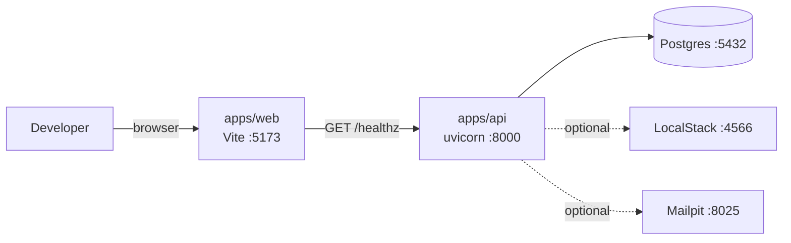

# Sprint 00 — Walking skeleton: monorepo + `shared_kernel` + Postgres + Alembic

**Goal.** `make local-up` brings up Docker Compose (Postgres + LocalStack + Mailpit); `make api` runs uvicorn on `:8000`; `make web` runs Vite on `:5173`; the web consumes `GET /healthz` and shows the result. The app talks to local Postgres, migration 0001 runs with a single command, RLS and outbox are scaffolded for later sprints. `/healthz` reports `db: "ok"` + Alembic revision. Local only — no AWS, no Terraform.

---

## Walking skeleton



---

## Monorepo layout

```
nica-erp/
├── apps/
│   ├── api/
│   │   ├── src/{shared_kernel,contexts,bootstrap}/
│   │   ├── tests/{unit,integration,e2e}/
│   │   ├── pyproject.toml
│   │   ├── Dockerfile          # placeholder, production-grade in sprint 01
│   │   └── alembic.ini         # migration 0001 ships here
│   └── web/
│       ├── src/{main.tsx,app.tsx,routes/,api/,components/ui/,styles/}
│       ├── {vite,tailwind,postcss,tsconfig,eslint}.config.*
│       ├── components.json     # shadcn/ui
│       └── package.json
├── infra/terraform/            # empty
├── docker/{docker-compose.yml,localstack-init.sh}
├── scripts/
├── docs/
├── .github/workflows/{api-checks.yml,web-checks.yml}
├── .pre-commit-config.yaml
└── Makefile
```

---

## Backend minimum

`apps/api/pyproject.toml` starts with FastAPI + pydantic-settings + structlog; dev: ruff, mypy, pytest, httpx, respx, import-linter, pre-commit. Plus DB stack: `sqlalchemy[asyncio]`, `asyncpg`, `psycopg[binary]` (sync driver for Alembic), `alembic`. Dev-only: `testcontainers[postgres]`. Cumulative list in [`../16-tooling.md` §Pinned versions](../16-tooling.md#pinned-versions).

```toml
dependencies = [
  "fastapi", "pydantic-settings", "structlog",
  "sqlalchemy[asyncio]>=2.0,<3.0",
  "asyncpg>=0.29,<0.30",
  "psycopg[binary]>=3.1,<4",
  "alembic>=1.13,<2.0",
]
[tool.uv]
dev-dependencies = ["testcontainers[postgres]>=4,<5"]
```

`apps/api/src/bootstrap/api.py` — FastAPI app with CORS for `:5173` and `/healthz`:

```python
@app.get("/healthz")
async def healthz(uow: UnitOfWork = Depends(get_uow)):
    async with uow.begin() as session:
        await session.execute(text("SELECT 1"))
        rev = await session.execute(text("SELECT version_num FROM alembic_version"))
    return {
        "status": "ok", "version": settings.version, "git_sha": settings.git_sha,
        "db": "ok", "alembic_revision": rev.scalar_one_or_none(),
    }
```

CORS is only active locally: in AWS the SPA and the API share the CloudFront origin ([ADR-0020](../adr/0020-no-custom-domain-mvp.md)).

`bootstrap/settings.py` (pydantic-settings, `.env.local`) exposes `app_env`, `version`, `git_sha` (reads `os.environ["GIT_SHA"]`, default `"unknown"`; never invokes `subprocess` at import), `cors_allowed_origins` (default `["http://localhost:5173"]`).

---

## `shared_kernel/domain/`

- `AggregateRoot` — `_id`, `_events: list[DomainEvent]`, `pull_events()`.
- `Entity`, `ValueObject` (frozen dataclass), `DomainEvent` (immutable base with `occurred_at`, `event_id`).
- `Money` — VO with `Decimal amount`, `str currency`. Add/subtract validate same currency.

## `shared_kernel/application/`

- `UnitOfWork` (Protocol): async-context-manager over `AsyncSession`.

  ```python
  class UnitOfWork(Protocol):
      def begin(self) -> AsyncContextManager[AsyncSession]: ...
      async def commit(self) -> None: ...
      async def rollback(self) -> None: ...
  ```

- `Command`, `Query` — marker base classes.
- `EventBus` (Protocol) + `InProcessEventBus` for domain events **intra-context** (synchronous). **Inter-context** events travel through the outbox.
- `OutboxWriter` (Protocol):

  ```python
  class OutboxWriter(Protocol):
      async def append(
          self, *, event_id: UUID, event_type: str, event_version: int,
          aggregate_type: str, aggregate_id: UUID, tenant_id: UUID,
          payload: dict, correlation_id: UUID | None = None,
      ) -> None: ...
  ```

  `OutboxWriterSqlAlchemy` (in `adapters/`) receives the `AsyncSession` from the active `UnitOfWork` to guarantee aggregate↔event atomicity.

## `shared_kernel/adapters/`

- `SqlAlchemyUnitOfWork`, `OutboxWriterSqlAlchemy`, `InProcessEventBus`.
- `TenantContext`, `CurrentUserContext` — request-scoped `ContextVar` (populated by middleware in sprints 02-03).

---

## SQLAlchemy + asyncpg

`bootstrap/db.py`:

```python
engine = create_async_engine(
    settings.database_url,
    pool_size=5, max_overflow=10,
    pool_pre_ping=True,
    pool_recycle=300,   # asyncpg closes idle ~5 min
)
SessionLocal = async_sessionmaker(engine, expire_on_commit=False)
```

---

## Alembic — migration 0001

Global `shared_kernel` tables:

- `tenants` — placeholder; NI fiscal metadata in [sprint 03](03-tenants-and-rls.md).
- `users` — placeholder; body in [sprint 02](02-identity-and-rbac.md).
- `outbox` — complete structure (see [`../07-events-and-outbox.md`](../07-events-and-outbox.md)). Includes `tenant_id UUID NOT NULL` from 0001 to avoid backfill; RLS arrives in [sprint 03](03-tenants-and-rls.md).
- `processed_events` — consumer-side idempotency.
- `idempotency_keys` — inbound idempotency.
- `system_info` — single row (`migrated_at`, `seed_version`) so `/healthz` can run `SELECT 1`.

---

## Frontend minimum

`apps/web/package.json` with scripts `dev`, `build` (`tsc --noEmit && vite build`), `typecheck`, `lint`, `format`, `test`, `gen:api` (`openapi-typescript http://localhost:8000/openapi.json -o src/api/schema.d.ts`).

Deps (sprint 00 minimum): `react`, `react-dom`, `@tanstack/react-router`, `@tanstack/react-query`, `openapi-fetch`, `tailwindcss`, `class-variance-authority`, `clsx`, `tailwind-merge`, `lucide-react`, `sonner`, `zod`. Later sprints add `react-hook-form` + `@hookform/resolvers` (forms — sprint 02), `date-fns` (date formatting — sprint 05), `i18next` + `react-i18next` (i18n — sprint 05). Full pinned list in [`../16-tooling.md` §Pinned versions](../16-tooling.md#pinned-versions).
Dev: `typescript`, `vite`, `@vitejs/plugin-react`, `eslint`, `prettier`, `vitest`, `openapi-typescript`.

`tsconfig.json` with `strict`, `noUncheckedIndexedAccess`, `exactOptionalPropertyTypes`, `verbatimModuleSyntax` and other strict flags (full config in [`../09-frontend.md`](../09-frontend.md)).

`apps/web/src/routes/index.tsx`: a minimal view consuming `/healthz` via TanStack Query through the generated OpenAPI client (`useHealthz` hook); shows `status` / `version` / `git_sha` / `alembic_revision` in a `Card` with a `Badge` (shadcn/ui).

---

## `import-linter`

`importlinter.toml` with contract "Domain free of SQLAlchemy/FastAPI/boto3" over `shared_kernel.domain` and `contexts.*.domain`; forbids `sqlalchemy`, `fastapi`, `boto3`, `shared_kernel.adapters`, `contexts.*.{application,adapters}`.

---

## Static toolchain

`.pre-commit-config.yaml` (hooks ruff format/check, mypy strict, web typecheck, web lint) and `.github/workflows/{api-checks,web-checks}.yml` (lint + types + unit tests, no deploy) with full config in [`../16-tooling.md` §Pre-commit hooks](../16-tooling.md#pre-commit-hooks) and [§GitHub Actions](../16-tooling.md#github-actions). No deploy workflows ([ADR-0023](../adr/0023-no-ci-cd-mvp.md)).

---

## Makefile (minimum)

```makefile
local-up:   ## docker compose up postgres + localstack + mailpit
	cd docker && docker compose up -d

local-down:
	cd docker && docker compose down

api:
	cd apps/api && uv run uvicorn bootstrap.api:app --reload

web:
	cd apps/web && pnpm dev

migrate:
	cd apps/api && uv run alembic upgrade head

migrate-down:
	cd apps/api && uv run alembic downgrade -1

makemigration:
	cd apps/api && uv run alembic revision -m "$(M)"

makemigration-auto:
	cd apps/api && uv run alembic revision --autogenerate -m "$(M)"

test:
	cd apps/api && uv run pytest

lint:
	cd apps/api && uv run ruff check . && uv run mypy src && uv run lint-imports
	cd apps/web && pnpm typecheck && pnpm lint

format:
	cd apps/api && uv run ruff format .
	cd apps/web && pnpm format
```

> This snippet shows only sprint-00 targets. `make seed`, `make worker-outbox`, `make worker-audit`, `make worker-notif`, plus AWS-side targets (`make deploy`, `make destroy`, `make bootstrap`, `make wipe`, `make plan`, `make logs`, `make deploy-web`) are introduced in later sprints and live in the canonical Makefile in [`../11-deployment.md` §Makefile](../11-deployment.md#makefile). Sprint 00 does not need them.

Literal tabs for recipes (indentation with spaces = `*** missing separator`).

---

## Sprint tests

- Unit: `Money` (add validates same currency, equality, subtraction policy).
- Integration: `SqlAlchemyUnitOfWork` against Postgres via `testcontainers` (begin/commit/rollback).
- E2E: `GET /healthz` → `db: "ok"` and valid Alembic revision.
- Frontend: `IndexRoute` with mocked `useHealthz` renders the "ok" badge and `alembic_revision`.

---

## Verifiable outcome (local)

```bash
git clone <repo> nica-erp && cd nica-erp
uv sync --project apps/api && pre-commit install
make local-up && make migrate && make api                          # terminal 1
pnpm --filter @nica-erp/web install && pnpm --filter @nica-erp/web gen:api
make web                                                           # terminal 2

curl http://localhost:8000/healthz
# → {"status":"ok","version":"0.1.0","git_sha":"...","db":"ok","alembic_revision":"0001_..."}
# Open http://localhost:5173: card with status/version/git_sha/alembic_revision.
```

Done: clone on a clean machine → web showing backend state in < 5 min.

---

## Deploy

No deploy. Under [ADR-0018](../adr/0018-rolling-deploys.md) sprint 00 is local-only foundation; Terraform, ECR, ALB and the frontend bucket arrive in [sprint 01](01-aws-wiring-rolling-deploys.md), when `make deploy` first runs `alembic upgrade head` against RDS. Remote demos during this sprint use an authenticated tunnel (Cloudflare Tunnel/ngrok) adjusting `VITE_API_BASE_URL` and `CORS_ORIGINS`.
