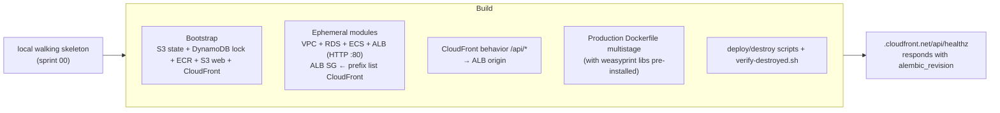

# Sprint 01 — Terraform bootstrap + first `make deploy` of the walking skeleton

**Goal.** `make bootstrap && make deploy` takes the walking skeleton from [sprint 00](00-walking-skeleton.md) to AWS. SPA and API share the CloudFront default origin (`https://<dist-id>.cloudfront.net/` for the SPA, `/api/*` to the ALB, [ADR-0020](../adr/0020-no-custom-domain-mvp.md)). `make destroy` returns to ≈ $0/month (no Route 53, no Secrets Manager). From here on, deploy/destroy is part of DoD ([ADR-0018](../adr/0018-rolling-deploys.md)).

No new domain features: what gets validated in AWS is the `/healthz` from sprint 00 with `db: "ok"` + `alembic_revision`. Deliverable: **reproducible deploy/destroy capability**.

> Replaces the old "sprint 09a — Terraform at the end", reversed in [ADR-0018](../adr/0018-rolling-deploys.md).

---

## Diagram



---

## Bootstrap (`infra/terraform/bootstrap/`)

Persistent resources, **single execution**. No hosted zone, no custom ACM ([ADR-0020](../adr/0020-no-custom-domain-mvp.md)).

- S3 `nica-erp-tf-state` (versioned, KMS).
- DynamoDB `nica-erp-tf-lock`.
- ECR `nica-erp` with lifecycle (last 5 images).
- S3 `nica-erp-web` (private, SSE-S3) + CloudFront with OAC. Custom error 403/404 → `/index.html` (SPA TanStack Router). Default cert `*.cloudfront.net`.
- CloudFront **two behaviors**: default `/*` → S3 web; `/api/*` → ALB origin HTTP-only. Same origin → no CORS.

Local state for bootstrap (chicken-and-egg). Detail in [`../11-deployment.md` § Bootstrap](../11-deployment.md#bootstrap-once).

First frontend build: `/healthz` card with `VITE_API_BASE_URL=/api` (relative path), uploaded with `make deploy-web`.

---

## Ephemeral modules (`infra/terraform/modules/`)

- **`network/`**: VPC, public/private subnets per AZ, 1 NAT Gateway, route tables, SGs, gateway VPC endpoints (S3, DynamoDB).
- **`data/`**: RDS PostgreSQL `db.t4g.micro` single-AZ, gp3 20 GB. Creds in SSM SecureString ([ADR-0021](../adr/0021-ssm-parameter-store.md)). Pre-launch: `skip_final_snapshot = true` ([ADR-0017](../adr/0017-backups-pitr.md)) — each `make destroy` loses the DB; the next deploy recreates it with Alembic + seed. Toggles off: `enable_rds_proxy = false`, `enable_read_replica = false`, `backup_retention_period = 0`.
- **`compute/`**: ECS cluster, task definitions (API + one-off migration), service, ALB HTTP only `:80` (no ACM), SG ingress restricted to prefix list `com.amazonaws.global.cloudfront.origin-facing` ([ADR-0020](../adr/0020-no-custom-domain-mvp.md)). Target tracking policy declared in Terraform; with `api_min_capacity = api_max_capacity = 1` (MVP defaults) it does not scale — raising `api_max_capacity` activates the policy without re-apply of the policy itself ([`../10-infrastructure.md` §API auto-scaling](../10-infrastructure.md#api-auto-scaling)).
- **`auth/`**: Cognito User Pool Lite with `custom:active_tenant` (mutable string, empty by default — populated when the user creates/switches tenants in [sprint 03](03-tenants-and-rls.md)). Declared from day one to avoid User Pool recreation later. User pool domain with default prefix `nica-erp.auth.us-east-1.amazoncognito.com` (enables OAuth/JWKS endpoints; Hosted UI not used in MVP — [ADR-0020 §Cognito user pool domain](../adr/0020-no-custom-domain-mvp.md#cognito-user-pool-domain)).
- **`secrets/`**: SSM SecureString for RDS creds + placeholders. `LOCAL_JWT_SECRET` does not apply in AWS.
- **`observability/`**: base alarms (5xx > 1% ALB 5 min, CPU > 80% RDS 10 min), SNS `nica-erp-alerts` to `alert_email`. Domain alarms in their sprints.

| Later module | Sprint |
|---|---|
| `email/` (SES email identity) | [02](02-identity-and-rbac.md) |
| `storage/` (S3 `nica-erp-files`) | [05](05-parties-and-sales.md) |
| `workers/` (outbox, audit, notif, fx, housekeeping) | [06](06-taxes-payments-reports.md) fx; [07](07-outbox-eventbridge-audit.md); [08](08-notifications-ses.md) notif |
| `messaging/` (EventBridge + SQS + DLQs) | [07](07-outbox-eventbridge-audit.md) |

No WAF, X-Ray, or Interface VPC endpoints (see [`../10-infrastructure.md` § Excluded from initial tier](../10-infrastructure.md#excluded-from-initial-tier)).

---

## `demo/` environment

`infra/terraform/envs/demo/` composes the modules. `backend.tf` points at the state bucket. `terraform.tfvars` (gitignored; example versioned) defines `alert_email`, `aws_region`, toggles. **No `domain_name`** under [ADR-0020](../adr/0020-no-custom-domain-mvp.md); the public URL comes from the `cloudfront_distribution_domain` output.

---

## Production Dockerfile

Multi-stage, installs native `weasyprint` libs from the start (real usage in [sprint 05](05-parties-and-sales.md)) to avoid a second iteration:

```dockerfile
FROM python:3.12-slim AS builder
WORKDIR /app
RUN pip install --no-cache-dir uv
COPY pyproject.toml uv.lock README.md ./
COPY src/ ./src/
RUN uv sync --frozen --no-dev --no-install-project && uv pip install --no-deps .

FROM python:3.12-slim
WORKDIR /app
RUN apt-get update && apt-get install -y --no-install-recommends \
      libcairo2 libgdk-pixbuf-2.0-0 libpangoft2-1.0-0 libpango-1.0-0 \
      shared-mime-info fonts-liberation libffi-dev \
 && rm -rf /var/lib/apt/lists/*
COPY --from=builder /app/.venv /app/.venv
COPY --from=builder /app/src /app/src
ENV PATH="/app/.venv/bin:$PATH"
ARG GIT_SHA=unknown
ENV GIT_SHA=$GIT_SHA
EXPOSE 8000
CMD ["uvicorn", "bootstrap.api:app", "--host", "0.0.0.0", "--port", "8000"]
```

Makefile invokes `docker build --build-arg GIT_SHA=$(git rev-parse HEAD) ...`.

---

## Scripts in `scripts/`

`bootstrap.sh`, `build-and-push-image.sh` (writes `.deploy-image-tag`), `run-migrations.sh` (ECS RunTask one-off with `entrypoint=["alembic","upgrade","head"]`), `check-credentials.sh`, `print-urls.sh` (reads `cloudfront_distribution_domain`), `tail-logs.sh`, `verify-destroyed.sh` (fails if NAT/ALB/RDS/ECS/Fargate/VPC with `Project=nica-erp` still alive), `deploy-web.sh` (`VITE_API_BASE_URL=/api` + `s3 sync` + invalidation), `confirm-destroy.sh`, `destroy-bootstrap.sh` (strong confirmation, empties S3/ECR).

Makefile: `bootstrap`, `deploy`, `destroy`, `destroy-bootstrap`, `wipe`, `plan`, `deploy-web`, `logs`. See [`../11-deployment.md` § Makefile](../11-deployment.md#makefile). `wipe` (= destroy + destroy-bootstrap) is a project-close operation, not a recurring DoD step.

---

## CORS in AWS

`bootstrap/settings.py` leaves `CORS_ORIGINS=[]` when `app_env=aws`; HTTP adapters do not mount `CORSMiddleware`. Locally it stays active (`:5173` ↔ `:8000`).

---

## Sprint tests

- **Full deploy/destroy cycle** (manual at close): `make destroy` → `make bootstrap` → `make deploy` → curl healthz → SPA with healthz card → `make destroy` → `verify-destroyed.sh`.
- **Terraform idempotency**: after `make deploy`, `terraform plan` reports "No changes" (caveats: `default_tags`, S3 ETags).
- **48h idle cost post-destroy**: Cost Explorer filter `Project=nica-erp` ≈ $0/month (S3 state/web nearly empty, DynamoDB on-demand, ECR single image, CloudFront no traffic, SSM free ≤10k params).

---

## Verifiable outcome

See README §Post-deploy verification, plus:
- `URL/api/healthz` returns `db:"ok"` + real `alembic_revision`.
- Card at `URL/` shows the same values.
- `make destroy` ~10 min (RDS slow even without final snapshot; see [`../11-deployment.md` §Destruction](../11-deployment.md#destruction)).

Session cost: ~3 USD.
