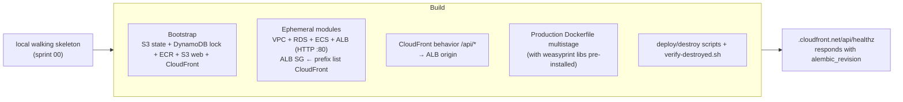

# Sprint 01 — Terraform bootstrap + first `make deploy` of the walking skeleton

**Goal.** `make bootstrap && make deploy` takes the walking skeleton from [sprint 00](00-walking-skeleton.md) to AWS. SPA and API share the CloudFront default origin (`https://<dist-id>.cloudfront.net/` for the SPA, `/api/*` to the ALB, [ADR-0020](../adr/0020-no-custom-domain-mvp.md)). `make destroy` returns to ≈ $0/month (no Route 53, no Secrets Manager). From here on, deploy/destroy is part of DoD ([ADR-0018](../adr/0018-rolling-deploys.md)).

No new domain features: what gets validated in AWS is the `/healthz` from sprint 00 with `db: "ok"` + `alembic_revision`. Deliverable: **reproducible deploy/destroy capability**.

> Replaces the old "sprint 09a — Terraform at the end", reversed in [ADR-0018](../adr/0018-rolling-deploys.md).

---

## Diagram



---

## Bootstrap (`infra/terraform/bootstrap/`)

Persistent resources, **single execution**. No hosted zone, no custom ACM ([ADR-0020](../adr/0020-no-custom-domain-mvp.md)).

- S3 `nica-erp-tf-state` (versioned, KMS).
- DynamoDB `nica-erp-tf-lock`.
- ECR `nica-erp` with lifecycle (last 5 images).
- S3 `nica-erp-web` (private, SSE-S3) + CloudFront with OAC. Custom error 403/404 → `/index.html` (SPA TanStack Router). Default cert `*.cloudfront.net`.
- CloudFront **two behaviors**: default `/*` → S3 web; `/api/*` → ALB origin HTTP-only. Same origin → no CORS.

Local state for bootstrap (chicken-and-egg). Detail in [`../11-deployment.md` § Bootstrap](../11-deployment.md#bootstrap-once).

First frontend build: `/healthz` card with `VITE_API_BASE_URL=/api` (relative path), uploaded with `make deploy-web`.

---

## Ephemeral modules (`infra/terraform/modules/`)

- **`network/`**: VPC, public/private subnets per AZ, 1 NAT Gateway, route tables, SGs, gateway VPC endpoints (S3, DynamoDB).
- **`data/`**: RDS PostgreSQL `db.t4g.micro` single-AZ, gp3 20 GB. Creds in SSM SecureString ([ADR-0021](../adr/0021-ssm-parameter-store.md)). Pre-launch: `skip_final_snapshot = true` ([ADR-0017](../adr/0017-backups-pitr.md)) — each `make destroy` loses the DB; the next deploy recreates it with Alembic + seed. Toggles off: `enable_rds_proxy = false`, `enable_read_replica = false`, `backup_retention_period = 0`.
- **`compute/`**: ECS cluster, task definitions (API + one-off migration), service, ALB HTTP only `:80` (no ACM), SG ingress restricted to prefix list `com.amazonaws.global.cloudfront.origin-facing` ([ADR-0020](../adr/0020-no-custom-domain-mvp.md)). Target tracking policy declared in Terraform; with `api_min_capacity = api_max_capacity = 1` (MVP defaults) it does not scale — raising `api_max_capacity` activates the policy without re-apply of the policy itself ([`../10-infrastructure.md` §API auto-scaling](../10-infrastructure.md#api-auto-scaling)).
- **`auth/`**: Cognito User Pool Lite with `custom:active_tenant` (mutable string, empty by default — populated when the user creates/switches tenants in [sprint 03](03-tenants-and-rls.md)). Declared from day one to avoid User Pool recreation later. User pool domain with default prefix `nica-erp.auth.us-east-1.amazoncognito.com` (enables OAuth/JWKS endpoints; Hosted UI not used in MVP — [ADR-0020 §Cognito user pool domain](../adr/0020-no-custom-domain-mvp.md#cognito-user-pool-domain)).
- **`secrets/`**: SSM SecureString for RDS creds + placeholders. `LOCAL_JWT_SECRET` does not apply in AWS.
- **`observability/`**: base alarms (5xx > 1% ALB 5 min, CPU > 80% RDS 10 min), SNS `nica-erp-alerts` to `alert_email`. Domain alarms in their sprints.

| Later module | Sprint |
|---|---|
| `email/` (SES email identity) | [02](02-identity-and-rbac.md) |
| `storage/` (S3 `nica-erp-files`) | [05](05-parties-and-sales.md) |
| `workers/` (outbox, audit, notif, fx, housekeeping) | [06](06-taxes-payments-reports.md) fx; [07](07-outbox-eventbridge-audit.md); [08](08-notifications-ses.md) notif |
| `messaging/` (EventBridge + SQS + DLQs) | [07](07-outbox-eventbridge-audit.md) |

No WAF, X-Ray, or Interface VPC endpoints (see [`../10-infrastructure.md` § Excluded from initial tier](../10-infrastructure.md#excluded-from-initial-tier)).

---

## `demo/` environment

`infra/terraform/envs/demo/` composes the modules. `backend.tf` points at the state bucket. `terraform.tfvars` (gitignored; example versioned) defines `alert_email`, `aws_region`, toggles. **No `domain_name`** under [ADR-0020](../adr/0020-no-custom-domain-mvp.md); the public URL comes from the `cloudfront_distribution_domain` output.

---

## Production Dockerfile

Multi-stage, installs native `weasyprint` libs from the start (real usage in [sprint 05](05-parties-and-sales.md)) to avoid a second iteration. Base image is `python:3.13-slim` to match `apps/api/pyproject.toml` (`requires-python = ">=3.13,<3.14"`):

```dockerfile
FROM python:3.13-slim AS builder
WORKDIR /app
RUN pip install --no-cache-dir uv
COPY pyproject.toml uv.lock README.md ./
COPY src/ ./src/
RUN uv sync --frozen --no-dev --no-install-project && uv pip install --no-deps .

FROM python:3.13-slim
WORKDIR /app
RUN apt-get update && apt-get install -y --no-install-recommends \
      libcairo2 libgdk-pixbuf-2.0-0 libpangoft2-1.0-0 libpango-1.0-0 \
      shared-mime-info fonts-liberation libffi-dev \
 && rm -rf /var/lib/apt/lists/*
COPY --from=builder /app/.venv /app/.venv
COPY --from=builder /app/src /app/src
ENV PATH="/app/.venv/bin:$PATH"
ARG GIT_SHA=unknown
ENV GIT_SHA=$GIT_SHA
EXPOSE 8000
CMD ["uvicorn", "bootstrap.api:app", "--host", "0.0.0.0", "--port", "8000"]
```

Per Python `weasyprint` package: the *native* apt libraries are baked in here; the Python package itself is added in sprint 05.

---

## Operations: 4 make targets, 2 surfaces

Sprint 01 closes with four operator-facing operations. Two of them — the project-lifecycle ones — run on the operator's local host because they create or destroy the foundation that everything else depends on (Terraform state backend, ECR repository, CloudFront distribution, GitHub OIDC provider, CI IAM roles). The other two — the recurring deploy/destroy cycle — run in GitHub Actions because the operator's host is Apple Silicon (arm64) and `docker build --platform linux/amd64` under QEMU segfaults during `uv sync`. Same reason, simpler model:

[ADR-0030](../adr/0030-ci-image-publish.md) supersedes [ADR-0023](../adr/0023-no-ci-cd-mvp.md).

| Make target | Surface | Trigger | What it does |
|---|---|---|---|
| `make bootstrap` | **local host, operator-only** | direct `terraform apply` against the `nica-erp` profile | provisions persistent infra: S3 state bucket, DynamoDB lock, ECR, S3 SPA + CloudFront, **GitHub OIDC provider, and the two CI IAM roles**. Idempotent. Run once at project setup; re-run only when the persistent infra changes. |
| `make destroy-bootstrap` | **local host, operator-only** | direct `terraform destroy` after terminal-prompt confirmation (`Type 'nica-erp-bootstrap' to confirm`) | tears down the persistent set after refusing if the ephemeral stack is still alive. Project-close operation only. |
| `make deploy` | **GHA workflow** (`.github/workflows/deploy.yml`, `workflow_dispatch`) | `gh workflow run deploy.yml` | end-to-end deploy: builds and pushes the API image, applies the ephemeral Terraform stack (VPC, RDS, ECS, ALB, Cognito, SSM, observability), runs `alembic upgrade head` via ECS RunTask, registers the new ECS task definition, builds the SPA, pushes to the SPA bucket, invalidates CloudFront. One command, one image tag, one CloudFront URL at the end. |
| `make destroy` | **GHA workflow** (`.github/workflows/destroy.yml`, `workflow_dispatch` + `confirm=nica-erp-ephemeral` input) | `gh workflow run destroy.yml -f confirm=nica-erp-ephemeral` | destroys the ephemeral stack only. Bootstrap, ECR images, and the SPA bucket survive (per [ADR-0003](../adr/0003-deploy-destroy-per-env.md), so the next `make deploy` is ~10 min, not ~30 min). |

`make deploy` and `make destroy` are the typical CI/CD path with the trigger gated behind `workflow_dispatch`; the day the team grows, adding `push: branches: [main]` to `deploy.yml` is a one-line YAML diff (the IAM role already trusts that ref).

### Why bootstrap stays on the operator's host

Bootstrap creates the GitHub OIDC provider and the IAM roles that the workflows assume. Chicken-and-egg: a workflow cannot create the role it would need to authenticate. The operator's `nica-erp` AWS CLI profile is the only path that exists before bootstrap has run, so bootstrap must use it. Once bootstrap exists, `make deploy` and `make destroy` use the roles via OIDC — no static keys in GitHub.

Destruction of the bootstrap is also operator-only and runs on the local host, for the same reason in reverse and because the bootstrap holds irrecoverable assets (state versions, CloudFront domain). The terminal-prompt confirmation in `scripts/destroy-bootstrap.sh` is the existing safety; no workflow improves on it.

### Auth: OIDC, one provider, two roles

The bootstrap Terraform declares one `aws_iam_openid_connect_provider` for `token.actions.githubusercontent.com` plus two `aws_iam_role` resources:

- **`nica-erp-ci-deploy`** — assumed by `deploy.yml`. Inline policy grants ECR push on the `nica-erp` repo ARN, Terraform-state read/write on `nica-erp-tf-state-*` and `nica-erp-tf-lock`, and the apply-side actions for the ephemeral resource set (VPC, RDS, ECS, ALB, Cognito, SSM, observability, S3 SPA put, CloudFront create-invalidation).
- **`nica-erp-ci-destroy`** — assumed by `destroy.yml`. Inline policy grants the destroy-side actions on the same ephemeral resource set plus Terraform-state read/write. Does NOT grant any action on the bootstrap resource set (S3 state bucket, ECR repository delete, CloudFront delete, IAM/OIDC mutation).

Both roles' trust policies bind to `repo:Steven-Mendez/nica-erp:ref:refs/heads/main` only — feature branches cannot assume them. Each ARN is exposed as a Terraform output (`ci_deploy_role_arn`, `ci_destroy_role_arn`); `scripts/bootstrap.sh` prints both at the end alongside the two literal `gh variable set` lines the operator pastes once.

### One-time operator setup (after the first `make bootstrap`)

1. Paste the two `gh variable set AWS_DEPLOY_ROLE_ARN ...` / `AWS_DESTROY_ROLE_ARN ...` lines the bootstrap script printed.
2. Done. No GitHub environment to configure — there is no `destroy-bootstrap` workflow.

From here on, the operator runs `make deploy` and `make destroy` exclusively via `gh workflow run`; the local host only needs `gh` and a browser to read the run page.

### Destructive gate on `make destroy`

`destroy.yml` requires a literal `confirm=nica-erp-ephemeral` input. The `make destroy` Makefile target pre-fills it; a manual `gh workflow run destroy.yml` without the flag (or with the wrong value) fails in the workflow's first step before any AWS API call.

### Auto-trigger on push to `main` is intentionally not enabled

`deploy.yml`'s `on:` block is structured so adding `push: branches: [main]` is a one-line diff. The `nica-erp-ci-deploy` role already trusts that ref. The day the team grows past one dev, the brake comes off with a YAML one-liner — no AWS-side change.

---

## Scripts in `scripts/`

`bootstrap.sh` (operator-host-only; prints the two `ci_*_role_arn` outputs + the `gh variable set` lines after apply), `destroy-bootstrap.sh` (operator-host-only; terminal-prompt confirmation, empties S3/ECR, refuses while the ephemeral stack is alive via `verify-destroyed.sh`).

`build-and-push-image.sh` (invoked by `deploy.yml` on the GHA runner; writes `.deploy-image-tag` in the runner's workspace — surfaced via the workflow's run summary), `run-migrations.sh` (called by `deploy.yml`; ECS RunTask one-off with `entrypoint=["alembic","upgrade","head"]`), `deploy-web.sh` (called by `deploy.yml`; `VITE_API_BASE_URL=/api` + `s3 sync` + CloudFront invalidation), `verify-destroyed.sh` (called by `destroy.yml`; fails if NAT/ALB/RDS/ECS/Fargate/VPC with `Project=nica-erp` still alive). All four are CI-aware: when `AWS_ACCESS_KEY_ID` is in env (OIDC path), they do not pin `AWS_PROFILE=nica-erp`.

Operator helpers (operator's host, read-only): `check-credentials.sh`, `print-urls.sh` (reads `cloudfront_distribution_domain`), `tail-logs.sh`.

Makefile (sprint 01 surface):
- `bootstrap` / `destroy-bootstrap` — direct execution on the operator's host, operator-only.
- `deploy` / `destroy` — `gh workflow run` wrappers.
- `wipe` = `destroy` + `destroy-bootstrap`; project-close convenience, not a DoD step.
- `plan`, `urls`, `logs` — operator's host helpers, read-only (`urls` invokes `scripts/print-urls.sh`).

See [`../11-deployment.md` § Makefile](../11-deployment.md#makefile) for the full target list.

---

## CORS in AWS

`bootstrap/settings.py` leaves `CORS_ORIGINS=[]` when `app_env=aws`; HTTP adapters do not mount `CORSMiddleware`. Locally it stays active (`:5173` ↔ `:8000`).

---

## Sprint tests

- **Full deploy/destroy cycle** (manual at close): `make destroy` → `make bootstrap` → `make deploy` → curl healthz → SPA with healthz card → `make destroy` → `verify-destroyed.sh`.
- **Terraform idempotency**: after `make deploy`, `terraform plan` reports "No changes" (caveats: `default_tags`, S3 ETags).
- **48h idle cost post-destroy**: Cost Explorer filter `Project=nica-erp` ≈ $0/month (S3 state/web nearly empty, DynamoDB on-demand, ECR single image, CloudFront no traffic, SSM free ≤10k params).

---

## Verifiable outcome

See README §Post-deploy verification, plus:
- `URL/api/healthz` returns `db:"ok"` + real `alembic_revision`.
- Card at `URL/` shows the same values.
- `make destroy` ~10 min (RDS slow even without final snapshot; see [`../11-deployment.md` §Destruction](../11-deployment.md#destruction)).

Session cost: ~3 USD.
