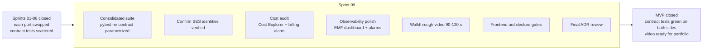

# Sprint 09 — MVP validation: contract tests + cost audit + walkthrough video

**Goal.** Close the MVP: consolidated suite of contract tests parametrized over all ports, final observability and cost polish, 90-120 s walkthrough video of the `make deploy → operate → make destroy` cycle. No domain features. **Under [ADR-0020](../adr/0020-no-custom-domain-mvp.md) exiting SES sandbox stays out of DoD**: the MVP ships with SES sandbox + email-only verification (no DKIM/DMARC).

> **Note on rename**: this sprint was previously a standalone "hardening" sprint. It is now reframed as the explicit **MVP validation gate** — the deliverables are unchanged, but the framing makes it clear that this phase is what gates the transition from "MVP code complete" to "MVP validated and pitchable to prospects".

It is not a first deploy: every Local↔AWS swap was exercised in its own sprint (Identity 02, FileStorage 05, FxRate 06, EventPublisher 07, Notif/SES 08). This sprint consolidates.

---

## Diagram



---

## Consolidated Local↔AWS contract test suite

`apps/api/tests/contract/`. Each port has a test parametrized over both adapters; they must pass identically. Individual tests were written in each sprint; here they all run against the same deploy.

```python
@pytest.mark.contract
@pytest.mark.parametrize("provider_factory", [
    pytest.param(make_local_provider, id="local"),
    pytest.param(make_cognito_provider, id="cognito"),
])
async def test_register_then_authenticate(provider_factory):
    provider = provider_factory()
    # Domain of alert_email (verified in SES sandbox).
    email = f"contract-{uuid4()}@{settings.alert_email.split('@')[1]}"
    await provider.register(SignupData(email=email, password="ContractTest1!@"))
    await provider.confirm_signup(email=email, code=get_test_code(email))
    identity = await provider.authenticate(Credentials(email=email, password="ContractTest1!@"))
    assert identity.email == email
    assert identity.access_token is not None
```

| Port | Test | Local | AWS |
|---|---|---|---|
| `IdentityProvider` | `test_identity_provider_contract.py` | `IdentityProviderLocal` | `IdentityProviderCognito` (dedicated test User Pool) |
| `EmailSender` | `test_email_sender_contract.py` | `EmailSenderSmtp` (Mailpit) | `EmailSenderSes` (sandbox, verified address) |
| `EventPublisher` | `test_event_publisher_contract.py` | `EventPublisherInProcess` | `EventPublisherEventBridge` (event → subscribed SQS; poll with timeout) |
| `FileStorage` | `test_file_storage_contract.py` | `FileStorageLocal` | `FileStorageS3` (PUT, GET presigned, DELETE) |
| `FxRateProvider` | `test_fx_rate_provider_contract.py` | `FxRateProviderMock` | `FxRateProviderBcn` (stable shape; rate against fixture) |
| `SecretsProvider` | `test_secrets_provider_contract.py` | `SecretsProviderLocal` | `SecretsProviderAwsSsm` |

`pytest -m contract` runs against a deployed test environment (prior `make deploy`). It does not run in GitHub Actions or in `make test` by default.

---

## Frontend architecture gates

`apps/web/`. Confirm the four rules from [`../09-frontend.md` §Architecture](../09-frontend.md#architecture) are enforced — not just documented. Each rule has one mechanical gate; together they make the rules verifiable instead of aspirational.

| Rule | Gate | How to verify |
|---|---|---|
| No cross-feature imports | ESLint `no-restricted-imports` blocks `features/*/` → other `features/*/` | `pnpm -C apps/web lint` fails when a forbidden import is introduced (smoke-test by adding one in a throwaway commit) |
| Permission gating | `<Can>` / `usePermission` / `requirePermission` cover every mutative button and route | Audit checklist against the catalog in [06 §Authorization](../06-security-model.md#authorization-rbac); `PermissionCode` typed union (generated with the OpenAPI client) breaks `tsc` on unknown codes |
| Error mapping | TanStack Query global `onError` → `mapProblemDetails`; no per-component HTTP `try/catch` | `pnpm -C apps/web typecheck` + spot grep over `apps/web/src/features/` for raw `catch` on `fetch`/client calls |
| Forms | Every form binds a Zod schema from `features/<x>/schemas/` | Grep: no `useForm(` without an accompanying `Schema` import in the same file |

Plus: `.env.production` carries no secrets (Vite bundles are public) — `grep -E "VITE_(.*SECRET|.*KEY|.*TOKEN)" apps/web/.env.production` must return empty.

These gates do not replace the existing CI checks in [`../16-tooling.md` §GitHub Actions](../16-tooling.md#github-actions) (`pnpm lint`, `pnpm typecheck`, `pnpm test --run`); they assert that the **architecture** of the frontend matches what the docs say.

---

## SES (no sandbox exit)

Without domain identity, domains cannot be verified — only individual email identities. Actions for the sprint:
- Confirm that `alert_email` and demo addresses remain verified in SES console (`us-east-1`).
- Document the limitation in the cost report.
- Note in [ADR-0020 §Reversal plan](../adr/0020-no-custom-domain-mvp.md) the path when a domain gets registered.

If a domain is registered for a serious prospect, this reopens as an additional sprint (not incorporated into the closed MVP).

---

## MVP cost audit

- Cost Explorer with filter `Project=nica-erp`, daily granularity, window from [sprint 01](01-aws-wiring-rolling-deploys.md).
- Idle ≈ **$0/month** under [ADR-0020](../adr/0020-no-custom-domain-mvp.md) + [ADR-0021](../adr/0021-ssm-parameter-store.md) (no Route 53, no custom ACM, no Secrets Manager; persistent = S3 state/web + DynamoDB + ECR, all near-free without traffic). Verification sessions ~2.70 USD/day.
- Total estimate: 9 sprints × ~3-5 USD/session = 25-50 USD. Verify.
- Billing alarm 20 USD/month pre-launch; 1-3 fires expected during the MVP.

---

## Observability polish

- EMF metrics (`outbox_pending_count`, `outbox_published_total`, `invoice_issue_duration_ms`, `dlq_depth`, `number_sequence_remaining_pct`, `tax_calculation_duration_ms`) in CloudWatch Metrics with alarms. See [`../10-infrastructure.md` § Metrics](../10-infrastructure.md#business-metrics-emf).
- Confirm that platform alarms (5xx > 1% ALB, DLQ > 0, CPU > 80% RDS, Lambda errors) notify `alert_email`. Alarm test if it never fired.
- CloudWatch dashboard `nica-erp-overview`: ALB requests/s, API p95 latency, RDS CPU/memory, outbox depth, DLQ depth.
- Predefined CloudWatch Logs Insights queries: by `request_id`, `tenant_id`, outbox `event_type`, recent error. Document in runbook.

---

## Teardown idempotency

- `make destroy` twice consecutively: second is no-op (`terraform plan` "No changes").
- No final RDS snapshot pre-launch (`skip_final_snapshot = true`, [ADR-0017](../adr/0017-backups-pitr.md)): each `make destroy` loses the DB; the next `make deploy` recreates it with Alembic + seed. `make wipe` + re-bootstrap work without gotchas.
- Expected persistence: **3 categories** (vs. 6 originally) — (1) S3 state + S3 web, (2) DynamoDB lock, (3) ECR. No hosted zone, Secrets Manager, or final snapshot.

---

## Walkthrough video (90-120 s)

Script:

1. (10 s) GitHub repo. Voice: "Multi-tenant ERP SaaS for NI SMBs. Hexagonal Python + DDD backend, React TanStack frontend, AWS Terraform infra."
2. (15 s) `make local-up && make api && make web`. Web at `localhost:5173`.
3. (15 s) Local flow: login → customer → invoice → PDF.
4. (20 s) `make bootstrap` (if needed) + `make deploy`. Terraform counter.
5. (20 s) `https://<dist-id>.cloudfront.net/` with the same flow against `/api/*` from the same origin.
6. (15 s) `make destroy`. `verify-destroyed.sh` exit 0.
7. (5 s) Voice: "Session cost ~3 USD. Idle ≈ $0/month. Ready for prospects."

Format: MP4 1080p, no music, Spanish voice/subtitles. S3 public or Drive linked from the root README.

---

## Final ADR review

Confirm status of all 29 ADRs. Most should be **Accepted**; **Provisional** ADRs ([ADR-0017](../adr/0017-backups-pitr.md), [ADR-0026](../adr/0026-tenant-lifecycle.md), [ADR-0028](../adr/0028-data-migration-strategy.md)) are expected to stay Provisional until their revisit trigger fires — re-evaluate each against its trigger and either promote to Accepted or document why it still waits. If implementation revealed a new decision, add it as `adr/NNNN-slug.md` and amend [`../adr/README.md`](../adr/README.md). If a decision changed, edit the existing ADR in place — no historicals.

## Final documentation

- Root README: quick-start local and AWS, links to `docs/`, link to the video.
- Runbook (`docs/runbook.md` or section in `../11-deployment.md`) with frequent troubleshooting.
- Diagrams to PNG in `docs/assets/` with `mermaid-cli` (optional).

---

## Sprint tests

- `pytest -m contract` green for the 6 ports on both adapters against a freshly deployed stack.
- SES to `alert_email` delivers OK; no SPF/DKIM/DMARC under [ADR-0020](../adr/0020-no-custom-domain-mvp.md).
- Complete e2e flow: signup → tenant → catalog → inventory → invoice → PDF → VAT book → audit log → email.
- Frontend gates green: `pnpm -C apps/web lint typecheck test --run` all pass; cross-feature import smoke test fails as expected; unknown `PermissionCode` fails `tsc` as expected.
- Double consecutive `make destroy`: second is no-op.
- `scripts/verify-destroyed.sh` exit 0.

---

## Verifiable outcome

See README §Post-deploy verification, plus:

```bash
make deploy
cd apps/api && uv run pytest -m contract -v             # all parametrized green
pnpm -C apps/web lint typecheck test --run              # frontend gates green
aws ses send-email --from <verified> --to <verified> --subject "test" --text "hi"
aws ce get-cost-and-usage --time-period Start=<MVP_START>,End=<TODAY> ...   # < 50 USD total
make destroy && make destroy                            # second no-op
./scripts/verify-destroyed.sh                           # exit 0
```

Done: contract tests green, emails delivered to verified addresses (sandbox), cost report under projection, video recorded, ADRs reviewed, double-destroy no-op. Product in validation phase with prospects.
