# Sprints

10 sprints (00–09) under rolling deploys ([ADR-0018](../adr/0018-rolling-deploys.md)).

- **00**: foundation — monorepo + walking skeleton + `shared_kernel` + Postgres + Alembic. Local only.
- **01**: first AWS deploy. Walking skeleton at `https://<dist-id>.cloudfront.net/` ([ADR-0020](../adr/0020-no-custom-domain-mvp.md)). `make deploy` + `make destroy` part of DoD from here on.
- **02–08**: vertical DDD slices; each sprint wires a local adapter + the AWS adapter (swap of the sprint's port) and closes with verification against the deployed stack.
- **09**: MVP validation — contract tests parametrized, cost audit, walkthrough video.

Template: [`template.md`](template.md).

---

## Per-sprint structure

```mermaid
flowchart LR
    Backend["Backend<br/>context + ports + adapters + tests"]
    Schema["OpenAPI<br/>updated"]
    Client["pnpm gen:api<br/>typed client"]
    Frontend["Frontend<br/>views + hooks + tests"]
    LocalE2E["Local verification<br/>make api + Mailpit/LocalStack"]
    Deploy["make deploy<br/>swap the sprint's port to its AWS adapter"]
    PubE2E["Public verification<br/>SPA + API same CloudFront origin"]
    Teardown["make destroy<br/>back to idle ~$0/month"]

    Backend --> Schema --> Client --> Frontend --> LocalE2E --> Deploy --> PubE2E --> Teardown
```



Sprint 00 closes at LocalE2E (no Terraform yet); sprints 01–09 run the full chain.

---

## Definition of Done (canonical)

Every criterion is mechanically verifiable (exit-0 command or evident result). Nothing is "almost".

- **Verifiable outcome** exercisable from the browser (not just curl or unit tests).
- **Backend tests**: `pytest -m unit` exit 0, coverage `domain/` + `application/` ≥ 70%; `pytest -m integration` exit 0 (at least one test per new outbound port); at least one `pytest -m e2e -k <flow>` for the sprint.
- **Frontend tests**: `pnpm typecheck`, `pnpm lint --max-warnings=0`, `pnpm format:check`, `pnpm test --run` — all exit 0.
- **Backend lint**: `ruff check`, `ruff format --check`, `mypy --strict` over `domain/` + `application/`, `uv run lint-imports` — all exit 0.
- **Post-build smoke**: `scripts/smoke-api.sh` (healthz + docs + one sprint POST) and `pnpm build && pnpm preview` with `curl` 200.
- **Dependency scan**: `pip-audit --strict` and `pnpm audit --prod --audit-level=high` with no `high`/`critical`. Exceptions require an issue.
- **Migrations**: `make migrate && make migrate-down && make migrate` clean.
- **OpenAPI**: `/docs` renders, `GET /openapi.json` validates; `pnpm gen:api` regenerated, `git diff schema.d.ts` clean.
- **From sprint 01**: `make deploy` exit 0, post-deploy checklist passes, `make destroy` exit 0, `scripts/verify-destroyed.sh` exit 0.
- **Docs**: if bounded-context map, port, or ADR-able decision changes → update doc/ADR + index row.

---

## Post-deploy verification (sprints 01–09)

Every sprint from 01 closes by running this protocol. Any failure = sprint not closed.

**Preconditions**:
- AWS credentials active (`aws sts get-caller-identity` exit 0).
- `infra/terraform/envs/demo/terraform.tfvars` present, **without** `domain_name` ([ADR-0020](../adr/0020-no-custom-domain-mvp.md)).
- SES email identities verified in the console for destinations used (applies from sprint 02 onward).

**Commands** (PowerShell — the repo assumes Windows + WSL/Git Bash for POSIX shells):
```powershell
make destroy 2>$null; if ($LASTEXITCODE -ne 0) { } ; make deploy; make deploy-web
$URL = (& ./scripts/print-urls.sh | Select-String '^App:').Line.Split()[1]
```

**Critical checklist**:
- `curl -fsS $URL/api/healthz` → 200 with `db: "ok"`.
- Sprint business flow completed in a clean browser against `$URL`.
- CloudWatch logs for the API task have no tracebacks after the flow.
- Relevant alarms (5xx ALB, DLQ depth, Lambda errors) in `OK`.

**Teardown**:
```bash
make destroy && ./scripts/verify-destroyed.sh   # both exit 0
```

Sprints reference this protocol with "Verifiable outcome: see README §Post-deploy verification, plus:" + sprint-specific checks.

Time-box: 1 day of debug before raising a flag. `make destroy` must always work (idempotent).

---

## Adapters by environment

Every port has a local adapter + an AWS production adapter. The AWS adapter is wired and exercised **in the same sprint that introduces the port** ([ADR-0018](../adr/0018-rolling-deploys.md)); sprint 09 runs the parametrized consolidated suite.

| Port | Sprint | Local (00–08) | AWS (01+) | Contract test (09) |
|---|---|---|---|---|
| `IdentityProvider` | 02 | `IdentityProviderLocal` (own JWT, bcrypt, codes in DB) | `IdentityProviderCognito` (User Pool Lite, JWKS cache) | `test_identity_provider_contract.py` |
| `EmailSender` | 02 | `EmailSenderSmtp` (Mailpit) | `EmailSenderSes` (sandbox permanent, [ADR-0020](../adr/0020-no-custom-domain-mvp.md)) | `test_email_sender_contract.py` |
| `FileStorage` | 05 | `FileStorageLocal` (`apps/api/.local-files/`) | `FileStorageS3` (`nica-erp-files`, SSE-S3 AES256) | `test_file_storage_contract.py` |
| `EventPublisher` | 07 | `EventPublisherInProcess` | `EventPublisherEventBridge` (Lambda outbox → bus) | `test_event_publisher_contract.py` |
| `SecretsProvider` | 01 | `SecretsProviderLocal` (`.env.local`) | `SecretsProviderAwsSsm` (SSM SecureString, cache 5 min, [ADR-0021](../adr/0021-ssm-parameter-store.md)) | `test_secrets_provider_contract.py` |
| `Clock` | 00 | `ClockReal`; `ClockMock` in tests | `ClockReal` identical | n/a |
| `FxRateProvider` | 06 | `FxRateProviderMock` (fixture) | `FxRateProviderBcn` (daily BCN scraper Lambda) | `test_fx_rate_provider_contract.py` |
| `OutboxWriter` | 00 | `OutboxWriterPostgres` | `OutboxWriterPostgres` identical | n/a |
| `Cache` (future) | post-MVP | `CacheInMemory` | `CacheElasticache` | pending |

Port contracts live in `domain/ports/` or `application/ports/`. Adapters in `infrastructure/adapters/<service>/`. Wiring in `bootstrap/container.py` per `APP_ENV`.

---

## Shared patterns

Conventions individual sprints **reference** rather than re-explain.

### Canonical bounded-context layout

```
contexts/<bc>/
├── domain/           # AggregateRoot, VOs, events (no SQLAlchemy/FastAPI)
├── application/      # use cases, inbound/outbound ports
└── adapters/         # http inbound, persistence, concrete outbound adapters
```

Detail in [`../02-architecture.md`](../02-architecture.md). `import-linter` blocks layer leaks (configured sprint 00).

### Local/AWS wiring

Each `build_<port>` in `bootstrap/container.py` branches on `settings.app_env`:

```python
def build_x() -> X:
    if settings.app_env == "local":
        return XLocal(...)
    return XAws(client=boto3.client("..."), ...)
```

`APP_ENV=local` reads `.env.local`; in AWS the task definition sets it to `aws` and settings come from SSM ([ADR-0021](../adr/0021-ssm-parameter-store.md)).

### RLS for tenant-scoped tables

Canonical pattern (`USING` + `WITH CHECK` + `FORCE ROW LEVEL SECURITY`) defined in [sprint 03](03-tenants-and-rls.md) and [ADR-0002](../adr/0002-postgres-rls.md). Every table with `tenant_id` applies it identically; later sprints just list the tables they touch.

### Lambda consumer with `processed_events` for idempotency

SQS consumer pattern (parse `body["detail"]`, SELECT/INSERT in `processed_events`, transaction with the domain insert, partial batch responses) defined in [sprint 07](07-outbox-eventbridge-audit.md). Later consumers (`notifications_worker`, etc.) just list their trigger and the events they handle.

### N+1 gate

Tests that exercise list/aggregate use cases assert query counts (via SQLAlchemy event hooks). Pattern in [`../14-testing.md` §N+1 gate](../14-testing.md#n1-gate). Sprint 06 (monthly IR accumulation) is the first to require it.

### Frontend pattern per sprint

Each sprint with new UI ships: typed routes in `apps/web/src/routes/` (TanStack Router), hooks via TanStack Query consuming the generated OpenAPI client, shadcn/ui components ([ADR-0009](../adr/0009-frontend-stack.md)), Zod validation in `schemas/` per context, Vitest tests for the critical flow, `pnpm gen:api` regenerated. Conventions in [`../09-frontend.md`](../09-frontend.md).

---

## Sprint index

| # | Goal |
|---|---|
| [00](00-walking-skeleton.md) | Monorepo `apps/api` + `apps/web`, walking skeleton (`/healthz`), `shared_kernel`, Postgres, Alembic 0001 |
| [01](01-aws-wiring-rolling-deploys.md) | Terraform bootstrap + first `make deploy`; SPA + API on CloudFront default |
| [02](02-identity-and-rbac.md) | Signup/login/`/me` against local IdP and real Cognito; permission catalog seeded |
| [03](03-tenants-and-rls.md) | Multi-tenancy with RLS; two tenants isolated, verified in AWS |
| [04](04-catalog-and-inventory.md) | `catalog` + `inventory` with kardex valued at weighted average |
| [05](05-parties-and-sales.md) | Invoice issuance with VAT, `FOR UPDATE` sequence, PDF in real S3 |
| [06](06-taxes-payments-reports.md) | `taxes` (IR/IMI), `payments`, VAT book, BCN scraper Lambda. N+1 gate applied to monthly IR accumulation |
| [07](07-outbox-eventbridge-audit.md) | Outbox publisher Lambda + EventBridge + `audit_consumer` + audit ledger |
| [08](08-notifications-ses.md) | `notifications_worker` Lambda + SES sandbox + Jinja2 templates |
| [09](09-mvp-validation.md) | Contract tests parametrized, cost audit, walkthrough video. Absorbed old "hardening" sprint |

---

## Post-MVP roadmap (out of scope)

Detail in [`../18-roadmap.md`](../18-roadmap.md). Sprints 10–13 are prerequisites to sell to a productive tenant; sprints 14+ extend the domain once operating.
